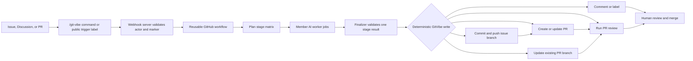

<h1 align="center">GitVibe</h1>

<p align="center">
  
</p>

<p align="center">
  <strong>Turn GitHub issues, discussions, labels, Actions, branches, and pull requests into a maintainer-gated AI development pipeline.</strong>
</p>

<p align="center">
  <a href="https://github.com/markhuangai/git-vibe"></a>
  <a href="https://github.com/markhuangai/git-vibe/issues"></a>
  <a href="https://github.com/markhuangai/git-vibe/blob/main/LICENSE"></a>
  
  
</p>

<p align="center">
  
  
  
  
  
</p>

<p align="center">
  <a href="#what-it-does">What it does</a> &nbsp;|&nbsp;
  <a href="#quick-start">Quick Start</a> &nbsp;|&nbsp;
  <a href="#commands">Commands</a> &nbsp;|&nbsp;
  <a href="#configuration">Configuration</a> &nbsp;|&nbsp;
  <a href="#security-model">Security</a> &nbsp;|&nbsp;
  <a href="#architecture">Architecture</a> &nbsp;|&nbsp;
  <a href="#development">Development</a>
</p>

---

## What it does

GitVibe is a hosted GitHub App automation layer for teams that want AI help
without moving product decisions, review, or merge authority out of GitHub.

It listens to GitHub App webhooks, verifies who is allowed to act, dispatches
reusable GitHub workflows, runs stage-specific AI workers, validates structured
AI output, and writes routine GitHub state changes with deterministic code.

| GitHub problem                                  | GitVibe answer                                                                                                     |
| ----------------------------------------------- | ------------------------------------------------------------------------------------------------------------------ |
| Bug reports need triage before code changes     | Investigate first, ask for expected behavior, validate maintainer context, then apply the protected approval label |
| Feature requests become scattered issue threads | Start in Discussions, validate acceptance criteria, then materialize one or more implementation issues             |
| AI tools can bypass normal repo process         | Keep approvals, labels, comments, branches, PRs, and merges inside GitHub                                          |
| Agent output is hard to audit                   | Require structured stage results, render traceable comments, and keep hidden source markers                        |
| Consumer repositories should stay small         | Copy tiny `.github` and `.git-vibe` starters and call reusable workflows from `markhuangai/git-vibe`               |

## Pipeline at a glance



GitVibe does not auto-merge, approve its own pull requests, or treat AI output as
authority. Maintainers stay in control of approval and release decisions.

## Workflows

| Workflow               | Use it for                                                            | Writes code?                           |
| ---------------------- | --------------------------------------------------------------------- | -------------------------------------- |
| `investigate.yml`      | Bug investigation and likely-root-cause analysis                      | No                                     |
| `validate.yml`         | Check whether maintainer context is coherent and actionable           | No                                     |
| `materialize.yml`      | Convert a validated Discussion into one or more implementation issues | No                                     |
| `develop.yml`          | Implement an approved issue, create or update a PR, then review it    | Yes, on `git-vibe/{root-issue}`        |
| `review.yml`           | Review an existing pull request with the configured review matrix     | No                                     |
| `address-feedback.yml` | Investigate PR feedback, apply required fixes, then review            | Conditional, on the existing PR branch |
| `ai-smoke.yml`         | Verify AI provider or trusted CLI setup on a runner                   | No repo changes                        |

The reusable workflows install Node `22` and pnpm `10.33.3` before building the
source-backed composite actions. Each composite action then reads
`.github/git-vibe.yml` for its stage and installs Codex CLI or Claude Code only
when the selected profile uses `cli-codex` or `cli-claude-code`.

`develop.yml` starts at implementation after investigation has already marked an
issue ready. Implementation validates with the repository's configured
`tests.commands`; failed validation output is fed back into a repair attempt
before GitVibe commits to the deterministic issue branch. GitVibe then creates
or updates the pull request and runs the PR-scoped review matrix. A passing review adds
`gvi:ready-for-approval` to the PR. A failing review posts the review result on
the PR and leaves it `gvi:blocked`.

`review.yml` runs the same PR-scoped review matrix for an existing pull request.
Trusted maintainers trigger it with the `git-vibe:review` label on a PR. GitVibe
removes stale ready/blocked state, adds `gvi:reviewing`, and then marks the PR
ready or blocked based on the review result.

Set `ai.stages.implement.enabled: false` to keep investigation, issue creation,
and PR review automation while disabling approved issue development. In that
mode, `git-vibe:approved` on an investigated issue is removed with an
explanation so maintainers can implement locally and still trigger review with
`git-vibe:review` on the pull request.

`address-feedback.yml` runs PR feedback investigation first. GitVibe replies to
false-positive, obsolete, or already-addressed review comments without coding. If
the investigation finds required fixes, GitVibe uses the same deterministic
branch-update engine as issue implementation but targets the existing PR head
branch. It does not create a new PR. After pushing the fix commit, it dispatches
the normal PR review workflow and restores `gvi:ready-for-approval` only after
review passes. If that review still returns `changes-required`, GitVibe
posts the review result on the PR, keeps the PR at `gvi:blocked`, and queues
another `address-feedback.yml` run when feedback automation is enabled. PR
feedback review retries stop after `ai.budgets.pr_feedback_max_iterations`
iterations, defaulting to three.

## Quick Start

### 1. Install the consumer starter

Run this from the repository that should use GitVibe:

```bash
npx git-vibe-setup setup
```

`git-vibe-setup setup` fetches the latest stable `markhuangai/git-vibe` release,
copies the consumer starter from this repository, pins generated reusable
workflow refs to that release tag, and stops without writing if any target file
already exists.

It creates:

- `.github/git-vibe.yml`
- `.github/workflows/*.yml`
- `.git-vibe/role-group/*.md`

The installer is local-only. It does not create commits, open pull requests, or
write secrets and variables for you. When `GITHUB_TOKEN` or `GH_TOKEN` is set,
`git-vibe-setup` uses it only to authenticate GitHub release and starter-file
reads so CI or shared-network runs avoid anonymous API throttling.

To update existing GitVibe workflow wrappers after upgrading `git-vibe-setup`,
run:

```bash
npx git-vibe-setup update
```

`update` rewrites only `.github/workflows/*.yml` GitVibe wrapper files and pins
them to the latest stable GitVibe release. It does not touch
`.github/git-vibe.yml`, `.git-vibe`, secrets, or variables, and it refuses to
overwrite workflow files that do not look like GitVibe wrappers.

For prerelease testing, pin an exact release tag from the consumer repository:

```bash
npx git-vibe-setup update --release v3.0.4-rc.1
```

Use `--include-prereleases` only when automatic latest-release lookup should be
allowed to choose prereleases.

### 2. Configure the consumer repo

Edit:

```text
.github/git-vibe.yml
```

The starter workflows call the public reusable workflow namespace:

```yaml
jobs:
  develop:
    uses: markhuangai/git-vibe/.github/workflows/develop.yml@<latest-stable-tag>
```

Reusable workflows operate on the repository where the workflow run starts
(`github.repository`). GitVibe does not accept a separate `owner/repo` workflow
input.

### 3. Add secrets and variables

Secrets belong in GitHub repository or organization secrets, not in
`.github/git-vibe.yml`.

`git-vibe-setup` prints this list after it writes files. It does not collect or
store secret values.

| Name                   | Required | Purpose                                                                  |
| ---------------------- | -------- | ------------------------------------------------------------------------ |
| `GITVIBE_AI_ENV_JSON`  | Yes      | JSON env bundle for AI provider config, CLI auth, and provider variables |
| `GITVIBE_MCP_ENV_JSON` | No       | JSON env bundle for configured MCP server credentials                    |

Useful variables:

```text
GITVIBE_BASE_BRANCH
GITVIBE_DISCUSSION_CATEGORY
GITVIBE_RUNNER
GITVIBE_LOG_LEVEL
```

Store AI provider values in `GITVIBE_AI_ENV_JSON`:

```json
{
  "CLAUDE_OAUTH_TOKEN": "...",
  "CODEX_AUTH_JSON": "{\"tokens\":[]}",
  "GITVIBE_AI_API_KEY": "...",
  "GITVIBE_AI_BASE_URL": "https://api.provider.example/v1",
  "MINIMAX_API_KEY": "...",
  "MINIMAX_ANTHROPIC_BASE_URL": "https://api.minimax.example/anthropic"
}
```

Store MCP credentials separately in `GITVIBE_MCP_ENV_JSON` when stages use
`ai.mcp.servers`:

```json
{
  "DENSE_MEM_API_KEY": "...",
  "PRIVATE_DOCS_TOKEN": "..."
}
```

Prepare Codex auth JSON as a compact string before adding it to the bundle:

```bash
jq -Rs . < ~/.codex/auth.json
```

Hosted GitVibe uses the installed GitHub App for GitHub writes. Customers do not
create a repository webhook or `GITVIBE_GITHUB_TOKEN` secret.

### 4. Run the app server

For local source runs:

```bash
corepack pnpm build:app
GITHUB_APP_ID=... \
GITHUB_APP_PRIVATE_KEY=... \
GITHUB_WEBHOOK_SECRET=... \
corepack pnpm start
```

For Docker Compose:

```bash
GITHUB_APP_ID=... \
GITHUB_APP_PRIVATE_KEY=... \
GITHUB_WEBHOOK_SECRET=... \
docker compose up -d
```

Runtime variables:

| Name                            | Required | Notes                                                            |
| ------------------------------- | -------- | ---------------------------------------------------------------- |
| Name                            | Required | Notes                                                            |
| -----------------------------   | -------- | ---------------------------------------------------------------- |
| `GITHUB_APP_ID`                 | Yes      | GitHub App ID                                                    |
| `GITHUB_APP_PRIVATE_KEY`        | Yes      | GitHub App private key                                           |
| `GITHUB_WEBHOOK_SECRET`         | Yes      | Must match the GitHub App webhook secret                         |
| `GITVIBE_ACTIONS_OIDC_AUDIENCE` | Optional | Defaults to `https://git-vibe.markhuang.ai/actions/token`        |
| `GITHUB_API_URL`                | Optional | Defaults to `https://api.github.com`                             |
| `GITHUB_REPOSITORY`             | Optional | `owner/repo` for startup Discussion preflight                    |
| `GITVIBE_DISCUSSION_CATEGORY`   | Optional | Defaults to `Ideas`                                              |

Workflow dispatch, new implementation branch bases, and pull request bases use
the repository variable `GITVIBE_BASE_BRANCH`. Empty or missing means GitVibe
uses the repository `default_branch` reported by GitHub.

### 5. Install the GitHub App

Install the GitVibe GitHub App on the repositories you want GitVibe to manage.
The App registration owns webhook delivery, so repositories do not create
repository webhooks.

GitHub App registration values:

```text
Homepage URL: https://markhuang.ai/manuals/git-vibe
Setup URL: https://markhuang.ai/manuals/git-vibe/repository-settings
Webhook URL: https://git-vibe.markhuang.ai/webhooks
Callback URL: blank
Request user authorization during installation: off
Device flow: off
```

Subscribe the App to these webhook events:

```text
Installation
Installation repositories
Issues
Issue comments
Sub-issues
Discussions
Discussion comments
Pull requests
Pull request reviews
```

Do not use "Send me everything"; GitVibe only needs the curated event set above.

## Commands And Labels

Use `/git-vibe` for the remaining comment-triggered workflows:

| Command                      | Typical surface           | Effect                                                        |
| ---------------------------- | ------------------------- | ------------------------------------------------------------- |
| `/git-vibe investigate`      | Bug issue                 | Runs investigation-only analysis and posts findings/questions |
| `/git-vibe address-feedback` | Pull request conversation | Investigates open PR feedback and fixes only actionable items |

Use protected labels for investigation, validation, materialization, and approval transitions:

| Label                  | Typical surface      | Effect                                                                         |
| ---------------------- | -------------------- | ------------------------------------------------------------------------------ |
| `git-vibe:investigate` | Bug issue            | Runs investigation, then GitVibe replaces the trigger with `gvi:investigating` |
| `git-vibe:validate`    | Issue or Discussion  | Runs validation, then GitVibe removes the trigger label                        |
| `git-vibe:approved`    | Implementation issue | Dispatches the development pipeline                                            |
| `git-vibe:approved`    | Feature Discussion   | Dispatches materialization after `gvi:validated`                               |
| `git-vibe:review`      | Pull request         | Dispatches PR review and marks the PR `gvi:reviewing` while it runs            |

`@git-vibe ...` is intentionally unsupported so commands do not look like GitHub
account mentions.

Accepted comment commands from admins and collaborators receive a `rocket`
reaction before GitVibe dispatches the workflow. When the reaction succeeds,
GitVibe does not also post a queued comment. If the reaction cannot be added,
GitVibe posts the queued workflow comment as a visible fallback.

Protected label dispatches and trusted `changes_requested` review dispatches
also post queued comments after dispatch succeeds. The queued comment includes
the exact workflow run URL when GitHub returns it; runner stages still post a
separate running comment when the GitHub Actions job starts. Approval reviews
and untrusted reviews do not start automation.

## Configuration

The main consumer config file is:

```text
.github/git-vibe.yml
```

Minimal shape:

```yaml
version: 1

github_auth:
  mode: github-app

ai:
  profiles:
    local_proxy:
      adapter: ai-sdk-agentool
      provider:
        type: openai-compatible
        model: glm-5
        base_url:
          from_bundle: GITVIBE_AI_BASE_URL
        api_key:
          from_bundle: GITVIBE_AI_API_KEY
      reasoning:
        effort: high
      # Optional explicit repo context. GitVibe does not auto-load AGENTS.md,
      # CLAUDE.md, or other native CLI files.
      # context:
      #   files:
      #     - AGENTS.md
  # Optional MCP servers. Stage entries decide which server tools are available.
  # Credentials referenced with from_bundle are read from GITVIBE_MCP_ENV_JSON.
  # mcp:
  #   servers:
  #     dense_mem:
  #       transport: stdio
  #       command: node
  #       args: ["./scripts/dense-mem-mcp.js"]
  #       env:
  #         DENSE_MEM_API_KEY:
  #           from_bundle: DENSE_MEM_API_KEY
  role_groups:
    review_gate:
      synthesizer: local_proxy
      parallel: 2
      roles:
        - role: correctness.md
          profile: local_proxy
        - role: security.md
          profile: local_proxy
  stages:
    investigate:
      role_group: review_gate
    validate:
      role_group: review_gate
    materialize:
      profile: local_proxy
    implement:
      profile: local_proxy
    review-matrix:
      role_group: review_gate
      # mcp:
      #   dense_mem:
      #     required: false
      #     tools: ["search_memory"]
    create-pr:
      profile: local_proxy
    address-pr-feedback:
      profile: local_proxy

tests:
  commands: []
```

GitVibe uses `/git-vibe ...` as the fixed public command form. Command prefixes,
external agent mentions, permissions, and label names are not configurable.

Each AI stage must define `profile` or `role_group`; GitVibe fails fast instead of
falling back to a profile name the repository may not have configured.
Role definitions referenced by `role_group` live in `.git-vibe/role-group/*.md`.
CLI adapters use fixed commands (`codex exec` and `claude -p`); profiles choose
adapter, model, auth, env, and reasoning settings, not the executable command.
They use native structured-output schema flags and do not receive
`output_validator` tool-call instructions.
Profiles may opt into shared repository guidance with
`ai.profiles.<name>.context.files`. Listed files are appended to the rendered
system prompt for that profile across `ai-sdk-agentool`, `cli-codex`, and
`cli-claude-code`; GitVibe never auto-loads `AGENTS.md` or `CLAUDE.md`.

Stages may also opt into MCP servers through `ai.stages.<stage>.mcp`. Each
server can expose a flat `tools` list to the model. For advanced deterministic
pre-model context, use `allow_tools.context` with `context_calls`; those results
are injected into the prompt before the model runs. Model tools are exposed to AI
SDK, Codex CLI, and Claude Code through a GitVibe gateway that enforces the stage
allowlist. `required` defaults to `true`; set it to `false` when missing MCP
context should warn instead of blocking the stage.

Set `tests.commands` to the consumer repository's own verification gate, such as
its lint, typecheck, unit test, or integration test commands.

Optional repository prompt additions live under
`.git-vibe/prompts/<stage>/system.md` and `.git-vibe/prompts/<stage>/user.md`.
They append to GitVibe's built-in prompts without replacing stage contracts,
schema requirements, or branch/file mutation boundaries. See
[Repository Prompt Additions](docs/AI.md#repository-prompt-additions).

Current implementation status:

| Area                                                                     | Status                      |
| ------------------------------------------------------------------------ | --------------------------- |
| Hosted GitHub App webhook mode                                           | Implemented                 |
| `ai-sdk-agentool` with OpenAI, Anthropic, or OpenAI-compatible endpoints | Implemented first           |
| Source-built composite actions and reusable workflows                    | Implemented                 |
| JSON Schema stage contracts                                              | Implemented                 |
| Relay, Actions-native receiver, and polling delivery modes               | Planned behind config shape |
| Active `cli-codex` and `cli-claude-code` stage adapters                  | Implemented                 |
| External GitHub mention partners                                         | Planned opt-in surface      |

See [docs/PROJECT_PLAN.md](docs/PROJECT_PLAN.md) for the full plan index.

## Security Model

| Boundary      | Rule                                                                                              |
| ------------- | ------------------------------------------------------------------------------------------------- |
| Webhooks      | The app verifies GitHub `x-hub-signature-256` before accepting events                             |
| Commands      | The server checks repository permission before protected actions                                  |
| Labels        | Public `git-vibe:` trigger labels are policy-gated; internal `gvi:` labels are GitVibe-managed    |
| Secrets       | App private keys and AI credentials stay in GitHub secrets or server runtime env, never in config |
| AI output     | Stage results are validated before deterministic GitVibe code writes GitHub state                 |
| Branch writes | Implementation uses `git-vibe/{root-issue}`; PR feedback updates the existing PR branch           |
| Pull requests | GitVibe can open or update PRs, but humans review and merge                                       |

Installation tokens are short-lived, repository-scoped, and minted from the
GitHub App private key. Never log or render App private keys, OIDC tokens, or
installation tokens.

## Architecture

GitVibe is one TypeScript package split by runtime boundary:

```text
src/
  app/       hosted GitHub App webhook server and repository orchestration
  runner/    action runtime, context assembly, prompts, schemas, AI execution
  shared/    GitHub helpers, labels, stage definitions, traceability types
```

The Docker image builds only app/shared output. Runner-only source, prompts, and
schemas are built by composite actions on the GitHub runner and do not trigger
app deployment unless shared, package, Docker, deploy, or app files change.

Detailed docs:

| Document                                     | Covers                                                                    |
| -------------------------------------------- | ------------------------------------------------------------------------- |
| [docs/ARCHITECTURE.md](docs/ARCHITECTURE.md) | System shape, GitHub App auth model, event delivery modes, consumer setup |
| [docs/WORKFLOW.md](docs/WORKFLOW.md)         | Issue, Discussion, label, approval, PR feedback, and traceability flows   |
| [docs/AI.md](docs/AI.md)                     | Context assembly, AI contracts, provider strategy, tool policy, budgets   |
| [docs/DEVELOPMENT.md](docs/DEVELOPMENT.md)   | Repo shape, quality gates, smoke tests, assumptions                       |

## Example action usage

```yaml
steps:
  - uses: actions/checkout@v4
    with:
      persist-credentials: false
  - uses: markhuangai/git-vibe/investigate@v3
    with:
      issue-number: "123"
```

## Example reusable workflow usage

```yaml
jobs:
  git-vibe-develop:
    uses: markhuangai/git-vibe/.github/workflows/develop.yml@v3
    with:
      issue-number: "123"
      runner: docker-runner
    secrets:
      GITVIBE_AI_ENV_JSON: ${{ secrets.GITVIBE_AI_ENV_JSON }}
      GITVIBE_MCP_ENV_JSON: ${{ secrets.GITVIBE_MCP_ENV_JSON }}
```

For source-repo testing, dispatch `investigate.yml`, `validate.yml`,
`materialize.yml`, `develop.yml`, `review.yml`, or
`address-feedback.yml` directly. Leave `action-repository` and `action-ref`
empty to test the current repository and ref.

## Development

Package manager:

```bash
corepack pnpm install --frozen-lockfile
```

Full local gate:

```bash
corepack pnpm check
```

Individual checks:

```bash
corepack pnpm format:check
corepack pnpm lint
corepack pnpm build
corepack pnpm test
corepack pnpm coverage
corepack pnpm actionlint
corepack pnpm audit --prod
```

Quality thresholds:

```text
branches: 90%
functions: 90%
lines: 90%
statements: 90%
```

JavaScript/MJS limits:

```text
max file length: 700 lines
max function length: 100 lines
```
