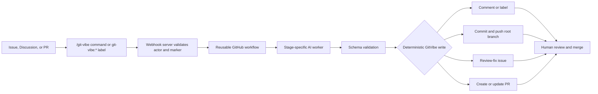

<h1 align="center">GitVibe</h1>

<p align="center">
  
</p>

<p align="center">
  <strong>Turn GitHub issues, discussions, labels, Actions, branches, and pull requests into a maintainer-gated AI development pipeline.</strong>
</p>

<p align="center">
  <a href="https://github.com/markhuangai/git-vibe"></a>
  <a href="https://github.com/markhuangai/git-vibe/issues"></a>
  <a href="https://github.com/markhuangai/git-vibe/blob/main/LICENSE"></a>
  
  
</p>

<p align="center">
  
  
  
  
  
</p>

<p align="center">
  <a href="#what-it-does">What it does</a> &nbsp;|&nbsp;
  <a href="#quick-start">Quick Start</a> &nbsp;|&nbsp;
  <a href="#commands">Commands</a> &nbsp;|&nbsp;
  <a href="#configuration">Configuration</a> &nbsp;|&nbsp;
  <a href="#security-model">Security</a> &nbsp;|&nbsp;
  <a href="#architecture">Architecture</a> &nbsp;|&nbsp;
  <a href="#development">Development</a>
</p>

---

## What it does

GitVibe is a self-hostable GitHub automation layer for teams that want AI help
without moving product decisions, review, or merge authority out of GitHub.

It listens to repository webhooks, verifies who is allowed to act, dispatches
reusable GitHub workflows, runs stage-specific AI workers, validates structured
AI output, and writes routine GitHub state changes with deterministic code.

| GitHub problem                                  | GitVibe answer                                                                                                      |
| ----------------------------------------------- | ------------------------------------------------------------------------------------------------------------------- |
| Bug reports need triage before code changes     | Investigate first, ask for expected behavior, validate maintainer context, then apply the protected approval label  |
| Feature requests become scattered issue threads | Start in Discussions, summarize the thread, validate acceptance criteria with a label, then approve materialization |
| AI tools can bypass normal repo process         | Keep approvals, labels, comments, branches, PRs, and merges inside GitHub                                           |
| Agent output is hard to audit                   | Require structured stage results, render traceable comments, and keep hidden source markers                         |
| Consumer repositories should stay small         | Copy a tiny `.github` starter and call reusable workflows from `git-vibe/actions`                                   |

## Pipeline at a glance



GitVibe does not auto-merge, approve its own pull requests, or treat AI output as
authority. Maintainers stay in control of approval and release decisions.

## Workflows

| Workflow               | Use it for                                                  | Writes code?                    |
| ---------------------- | ----------------------------------------------------------- | ------------------------------- |
| `investigate.yml`      | Bug investigation and likely-root-cause analysis            | No                              |
| `summarize.yml`        | Feature discussion summary and open-question extraction     | No                              |
| `validate.yml`         | Check whether maintainer context is coherent and actionable | No                              |
| `materialize.yml`      | Convert a validated Discussion into an implementation issue | No                              |
| `develop.yml`          | Investigate, implement, review, and create or update a PR   | Yes, on `git-vibe/{root-issue}` |
| `address-feedback.yml` | Apply requested PR feedback to the existing GitVibe branch  | Yes, on the existing PR branch  |
| `ai-smoke.yml`         | Verify AI provider or trusted CLI setup on a runner         | No repo changes                 |

The reusable workflows install Node `22` and pnpm `10.33.3` before building the
source-backed composite actions. Each composite action then reads
`.github/git-vibe.yml` for its stage and installs Codex CLI or Claude Code only
when the selected profile uses `cli-codex` or `cli-claude-code`.

`develop.yml` runs investigation, implementation, review, and PR creation as
separate GitHub Actions jobs. Implementation starts only when investigation
returns `ready-for-implementation`, no blocking questions, and a concrete
implementation plan. Implementation validates with the repository's configured
`tests.commands`; failed validation output is fed back into a repair attempt
before GitVibe commits. PR creation only runs after `review-matrix` returns
`review-passed`. When review returns `changes-required`, GitVibe posts a short
parent comment, creates an internal `gvi:review-fix` follow-up issue with the
detailed findings, links it as a sub-issue, and dispatches another development
run on the same root branch. The internal label webhook is validated for marker
integrity but does not dispatch a second run. The current workflow run fails
before PR creation; the follow-up run creates or updates the PR only after its
own review passes.

## Quick Start

### 1. Copy the consumer starter

Run this from the repository that should use GitVibe:

```bash
cp -R /path/to/git-vibe/examples/consumer/.github /path/to/your-repo/.github
```

Copy only `examples/consumer/.github`. Do not copy GitVibe's internal action
folders such as `investigate/`, `implement/`, `app/`, or `src/`.

### 2. Configure the consumer repo

Edit:

```text
.github/git-vibe.yml
```

The starter workflows call the public reusable workflow namespace:

```yaml
jobs:
  develop:
    uses: git-vibe/actions/.github/workflows/develop.yml@main
```

Reusable workflows operate on the repository where the workflow run starts
(`github.repository`). GitVibe does not accept a separate `owner/repo` workflow
input.

### 3. Add secrets and variables

Secrets belong in GitHub repository or organization secrets, not in
`.github/git-vibe.yml`.

| Name                   | Required | Purpose                                                                     |
| ---------------------- | -------- | --------------------------------------------------------------------------- |
| `GITVIBE_AI_ENV_JSON`  | Yes      | JSON env bundle for AI provider config, CLI auth, and provider variables    |
| `GITVIBE_GITHUB_TOKEN` | Yes      | Fine-grained PAT for server-side and workflow GitHub writes                 |
| `WEBHOOK_SECRET`       | Yes      | GitHub webhook shared secret; deployment maps it to `GITHUB_WEBHOOK_SECRET` |

Useful variables:

```text
GITVIBE_BASE_BRANCH
GITVIBE_DISCUSSION_CATEGORY
GITVIBE_RUNNER
GITVIBE_LOG_LEVEL
```

Store AI provider values in `GITVIBE_AI_ENV_JSON`:

```json
{
  "CLAUDE_OAUTH_TOKEN": "...",
  "CODEX_AUTH_JSON": "{\"tokens\":[]}",
  "GITVIBE_AI_API_KEY": "...",
  "GITVIBE_AI_BASE_URL": "https://api.provider.example/v1",
  "MINIMAX_API_KEY": "...",
  "MINIMAX_ANTHROPIC_BASE_URL": "https://api.minimax.example/anthropic"
}
```

Prepare Codex auth JSON as a compact string before adding it to the bundle:

```bash
jq -Rs . < ~/.codex/auth.json
```

Create `GITVIBE_GITHUB_TOKEN` as a fine-grained PAT scoped to the managed
repository. See
[fine-grained PAT repository permissions](docs/WORKFLOW.md#fine-grained-pat-permissions)
for the required permission set and access levels. Include repository Actions
secrets read/write permission only when using `CODEX_AUTH_JSON`, because GitVibe
then writes refreshed Codex auth back to the repository `GITVIBE_AI_ENV_JSON`
secret.

### 4. Run the app server

For local source runs:

```bash
corepack pnpm build:app
GITHUB_WEBHOOK_SECRET=... \
GITVIBE_GITHUB_TOKEN=... \
corepack pnpm start
```

For Docker Compose:

```bash
GITHUB_WEBHOOK_SECRET=... \
GITVIBE_GITHUB_TOKEN=... \
docker compose up -d
```

Runtime variables:

| Name                          | Required | Notes                                             |
| ----------------------------- | -------- | ------------------------------------------------- |
| `GITHUB_WEBHOOK_SECRET`       | Yes      | Must match the repository webhook secret          |
| `GITVIBE_GITHUB_TOKEN`        | Yes      | Fine-grained PAT scoped to the managed repository |
| `GITHUB_API_URL`              | Optional | Defaults to `https://api.github.com`              |
| `GITHUB_REPOSITORY`           | Optional | `owner/repo` for startup Discussion preflight     |
| `GITVIBE_DISCUSSION_CATEGORY` | Optional | Defaults to `Ideas`                               |

Workflow dispatch, new implementation branch bases, and pull request bases use
the repository variable `GITVIBE_BASE_BRANCH`. Empty or missing means GitVibe
uses the repository `default_branch` reported by GitHub.

### 5. Configure the repository webhook

Create a repository webhook:

```text
Payload URL: https://<your-gitvibe-host>/webhooks
Content type: application/json
Secret: same value as WEBHOOK_SECRET
SSL verification: enabled
```

Select individual events:

```text
Issues
Issue comments
Sub-issues
Discussions
Discussion comments
Pull requests
Pull request reviews
```

Do not use "Send me everything"; GitVibe only needs the curated event set above.

## Commands And Labels

Use `/git-vibe` for the remaining comment-triggered workflows:

| Command                      | Typical surface           | Effect                                                        |
| ---------------------------- | ------------------------- | ------------------------------------------------------------- |
| `/git-vibe investigate`      | Bug issue                 | Runs investigation-only analysis and posts findings/questions |
| `/git-vibe summarize`        | Feature Discussion        | Summarizes the full conversation and open questions           |
| `/git-vibe address-feedback` | Pull request conversation | Applies requested PR feedback on the GitVibe branch           |

Use protected labels for validation and approval transitions:

| Label               | Typical surface      | Effect                                                                       |
| ------------------- | -------------------- | ---------------------------------------------------------------------------- |
| `git-vibe:validate` | Issue or Discussion  | Runs validation, then GitVibe removes the trigger label                      |
| `git-vibe:approved` | Implementation issue | Dispatches the development pipeline                                          |
| `git-vibe:approved` | Feature Discussion   | Dispatches materialization, which creates an issue and closes the Discussion |

`@git-vibe ...` is intentionally unsupported so commands do not look like GitHub
account mentions.

Accepted commands from admins and collaborators receive a `rocket` reaction
before GitVibe dispatches the workflow, then a queued comment after dispatch
succeeds. Discussion comments receive threaded replies where GitHub supports
them. Issue comments and pull request conversation comments receive a flat reply
with an `In reply to` source link.

Protected label dispatches and trusted `changes_requested` review dispatches
also post queued comments after dispatch succeeds. The queued comment includes
the exact workflow run URL when GitHub returns it; runner stages still post a
separate running comment when the GitHub Actions job starts. Approval reviews
and untrusted reviews do not start automation.

## Configuration

The main consumer config file is:

```text
.github/git-vibe.yml
```

Minimal shape:

```yaml
version: 1

commands:
  prefix: /git-vibe

runner:
  default: ubuntu-latest

github_auth:
  mode: webhook-pat
  token_secret: GITVIBE_GITHUB_TOKEN

ai:
  profiles:
    local_proxy:
      enabled: true
      adapter: ai-sdk-agentool
      provider:
        type: openai-compatible
        model: glm-5
        base_url:
          from_bundle: GITVIBE_AI_BASE_URL
        api_key:
          from_bundle: GITVIBE_AI_API_KEY
      reasoning:
        effort: high
  stages:
    investigate:
      profile: local_proxy
    summarize:
      profile: local_proxy
    validate:
      profile: local_proxy
    materialize:
      profile: local_proxy
    implement:
      profile: local_proxy
    review-matrix:
      profiles:
        - local_proxy
    create-pr:
      profile: local_proxy
    address-pr-feedback:
      profile: local_proxy

tests:
  commands: []
```

Each AI stage must define `profile` or `profiles`; GitVibe fails fast instead of
falling back to a profile name the repository may not have configured.

Set `tests.commands` to the consumer repository's own verification gate, such as
its lint, typecheck, unit test, or integration test commands.

Current implementation status:

| Area                                                                     | Status                                        |
| ------------------------------------------------------------------------ | --------------------------------------------- |
| Direct repository webhook mode                                           | Implemented first                             |
| `ai-sdk-agentool` with OpenAI, Anthropic, or OpenAI-compatible endpoints | Implemented first                             |
| Source-built composite actions and reusable workflows                    | Implemented                                   |
| JSON Schema stage contracts                                              | Implemented                                   |
| Relay, Actions-native receiver, and polling delivery modes               | Planned behind config shape                   |
| Active `cli-codex` and `cli-claude-code` stage adapters                  | Planned; smoke-test support exists separately |
| External GitHub mention partners                                         | Planned opt-in surface                        |

See [docs/PROJECT_PLAN.md](docs/PROJECT_PLAN.md) for the full plan index.

## Security Model

| Boundary      | Rule                                                                                |
| ------------- | ----------------------------------------------------------------------------------- |
| Webhooks      | The app verifies GitHub `x-hub-signature-256` before accepting events               |
| Commands      | The server checks repository permission before protected actions                    |
| Labels        | Public `git-vibe:` labels are policy-gated; internal `gvi:` labels are GitVibe-only |
| Secrets       | Tokens stay in GitHub secrets or server runtime env, never in config                |
| AI output     | Stage results are validated before deterministic GitVibe code writes GitHub state   |
| Branch writes | Implementation uses deterministic root issue branches: `git-vibe/{root-issue}`      |
| Pull requests | GitVibe can open or update PRs, but humans review and merge                         |

The PAT is long-lived. Scope it narrowly to the managed repository and never log
or render it.

## Architecture

GitVibe is one TypeScript package split by runtime boundary:

```text
src/
  app/       self-hosted webhook server and repository orchestration
  runner/    action runtime, context assembly, prompts, schemas, AI execution
  shared/    GitHub helpers, labels, stage definitions, traceability types
```

The Docker image builds only app/shared output. Runner-only source, prompts, and
schemas are built by composite actions on the GitHub runner and do not trigger
app deployment unless shared, package, Docker, deploy, or app files change.

Detailed docs:

| Document                                     | Covers                                                                  |
| -------------------------------------------- | ----------------------------------------------------------------------- |
| [docs/ARCHITECTURE.md](docs/ARCHITECTURE.md) | System shape, webhook/PAT model, event delivery modes, consumer setup   |
| [docs/WORKFLOW.md](docs/WORKFLOW.md)         | Issue, Discussion, label, approval, PR feedback, and traceability flows |
| [docs/AI.md](docs/AI.md)                     | Context assembly, AI contracts, provider strategy, tool policy, budgets |
| [docs/DEVELOPMENT.md](docs/DEVELOPMENT.md)   | Repo shape, quality gates, smoke tests, assumptions                     |

## Example action usage

```yaml
steps:
  - uses: actions/checkout@v4
  - uses: git-vibe/actions/investigate@main
    with:
      token: ${{ secrets.GITVIBE_GITHUB_TOKEN }}
      issue-number: "123"
```

## Example reusable workflow usage

```yaml
jobs:
  git-vibe-develop:
    uses: git-vibe/actions/.github/workflows/develop.yml@main
    with:
      issue-number: "123"
      runner: self-hosted
    secrets:
      GITVIBE_GITHUB_TOKEN: ${{ secrets.GITVIBE_GITHUB_TOKEN }}
      GITVIBE_AI_ENV_JSON: ${{ secrets.GITVIBE_AI_ENV_JSON }}
```

For source-repo testing, dispatch `investigate.yml`, `summarize.yml`,
`validate.yml`, `materialize.yml`, `develop.yml`, or `address-feedback.yml`
directly. Leave `action-repository` and `action-ref` empty to test the current
repository and ref.

## Development

Package manager:

```bash
corepack pnpm install --frozen-lockfile
```

Full local gate:

```bash
corepack pnpm check
```

Individual checks:

```bash
corepack pnpm format:check
corepack pnpm lint
corepack pnpm build
corepack pnpm test
corepack pnpm coverage
corepack pnpm actionlint
corepack pnpm audit --prod
```

Quality thresholds:

```text
branches: 90%
functions: 90%
lines: 90%
statements: 90%
```

JavaScript/MJS limits:

```text
max file length: 700 lines
max function length: 100 lines
```
