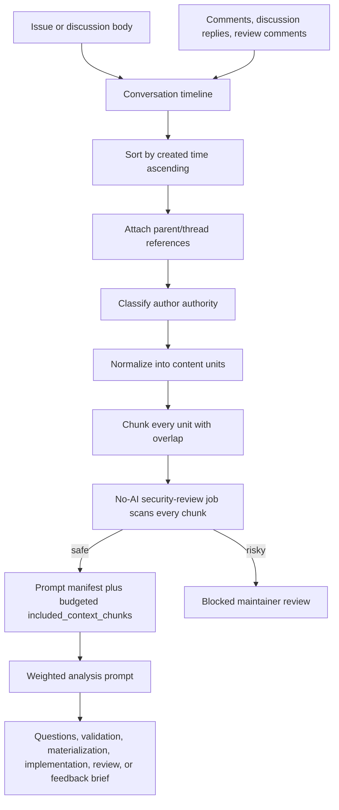
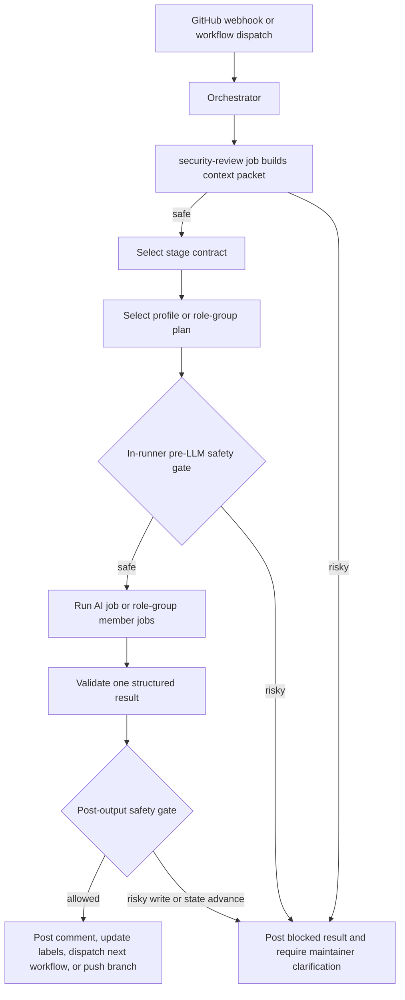
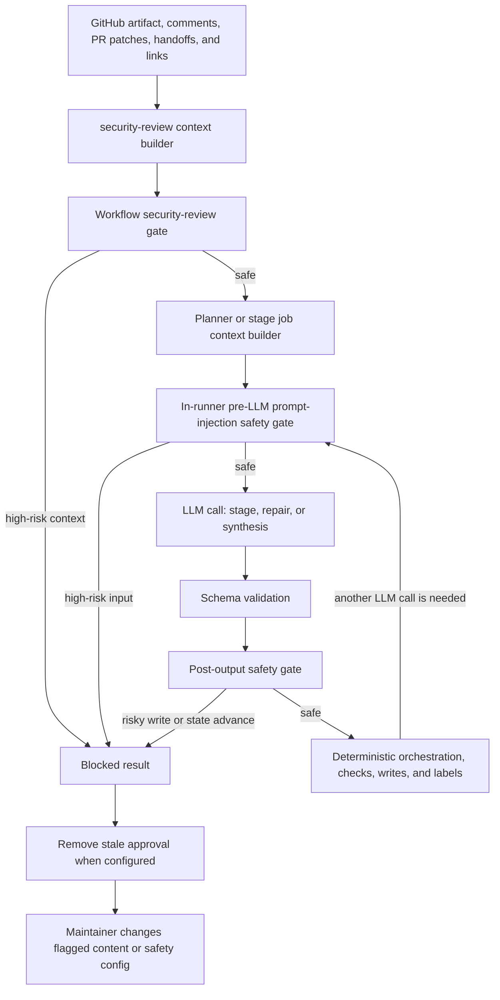

# AI Architecture

## Context Assembly And Analysis

All investigation, validation, materialization, implementation, review, and PR
feedback remediation runs must build context from the full GitHub conversation,
not just the initial description.



Context assembly rules:

- Include the issue or discussion title and body first.
- Include all issue comments, discussion comments, discussion replies, pull request comments, and pull request review threads relevant to the current stage.
- For PR feedback investigation, include unresolved current review threads plus the GitVibe source issue, linked source discussion, parent issues, sub-issues, and their comments.
- Include `source.comment` metadata when the run was triggered by a command comment. The model should answer that source directly; deterministic GitVibe publishing decides whether the target supports a true threaded reply or needs a flat comment with a source link.
- Sort every item by creation time ascending. For threaded discussion replies, preserve the parent comment reference while still making the final analysis timeline chronological.
- Include author, author association, repository permission when available, timestamp, URL, reactions, and whether the comment was authored by GitVibe or another bot.
- Treat newer maintainer clarification as stronger than older lower-authority speculation, but do not discard contributor or guest reports; they may contain reproduction details.
- Weight analysis by authority: admin/owner/maintain > write/collaborator/member > contributor > first-time contributor/guest/none.
- When repository permission and `author_association` disagree, repository permission is stronger for approval and command authorization; `author_association` remains useful analysis metadata.
- Keep the context packet complete. GitVibe converts GitHub content into content
  units, scans all overlapping chunks before LLM execution, and renders prompts
  with `github_context.context_manifest` plus budgeted
  `included_context_chunks`. Pending chunks remain listed by id for traceability
  and runner telemetry; they do not block `completed` results solely because the
  fixed prompt budget omitted them.

The same context assembly and weighted analysis pipeline applies to bug
investigation, feature discussion validation, materialization, implementation,
review, and PR feedback handling.

## Stage Contracts

GitVibe should treat AI as a set of stage-specific workers behind stable contracts. The GitVibe server/orchestrator owns permissions, state transitions, labels, workflow dispatch, and traceability. AI workers only produce structured recommendations, comments, code changes, or review results for the stage they are assigned.



AI integration layers:

- Orchestrator: deterministic code that validates actor permissions, reads config, builds context, enforces stage gates, and writes GitHub state.
- Context builder: gathers issue/discussion/PR timelines, repo snapshots, relevant files, reactions, workflow history, and linked artifacts into a stage-specific context packet.
- Stage contracts: typed task definitions for investigation, validation,
  materialization, implementation, pull request creation, review, and feedback
  remediation.
- AI adapter: `ai-sdk-agentool` is the primary adapter for all AI SDK-backed work. Structured-only stages use the same adapter with no tools or read-only tools.
- CLI adapters: `cli-codex` and `cli-claude-code` run fixed non-interactive CLI commands, stream CLI output to the action log, and parse structured output.
- MCP gateway: stage-scoped MCP servers can provide deterministic prompt context
  and model-callable tools. GitVibe resolves credentials, enforces per-stage
  allowlists, and scans MCP tool output before it reaches a model.
- External mention adapter: not currently implemented.
- Result validator: checks that AI output matches the stage schema, references the supplied context, and does not request disallowed actions.
- Prompt-injection safety gate: deterministic policy that runs once as a no-AI
  workflow job before any LLM-capable job starts, then runs again inside the
  runner before each LLM call and after validated stage output.

Implemented stage contracts:

| Stage                 | Schema                   | Repository scope                        | Output                                                                           | May advance state                                                |
| --------------------- | ------------------------ | --------------------------------------- | -------------------------------------------------------------------------------- | ---------------------------------------------------------------- |
| `investigate`         | `investigate.v1`         | Issue timeline, or PR feedback context  | Findings, blocking questions, implementation plan, or PR feedback classification | May mark issue investigated/blocked or PR feedback state         |
| `validate`            | `validate.v1`            | Issue or Discussion context             | Readiness decision, contradictions, questions, implementation brief              | May mark issue ready for approval or Discussion validated        |
| `materialize`         | `materialize.v2`         | Accepted validated Discussion           | One or more implementation issue drafts with dependencies and review guidance    | Creates `gvi:story` implementation issues and closes source      |
| `implement`           | `implement.v1`           | `git-vibe/{root-issue}` issue branch    | Working tree changes, test rationale, implementation summary                     | Uses branch-update engine; may commit and push issue branch      |
| `create-pr`           | `create-pr.v1`           | GitVibe issue branch                    | Pull request title and body                                                      | Creates or updates the PR and marks source issue `gvi:pr-opened` |
| `review-matrix`       | `review-matrix.v1`       | Pull request diff and review context    | Evidence-backed findings, pass/fail result, optional inline PR comments          | May mark a PR ready or blocked, and may queue feedback retries   |
| `address-pr-feedback` | `address-pr-feedback.v1` | Existing same-repository PR head branch | Fix commits or skipped-feedback rationale                                        | Uses branch-update engine; may update PR branch, not create PR   |

There is no standalone `decompose` stage. Splitting accepted scope into
multiple implementation issues happens inside `materialize`.

AI result envelope:

```json
{
  "stage": "investigate",
  "status": "blocked",
  "confidence": 0.74,
  "summary": "...",
  "findings": [],
  "inline_comments": [],
  "blocking_questions": ["What expected behavior should implementation preserve?"],
  "questions": [],
  "assumptions": [],
  "proposed_labels": [],
  "next_state": "needs-info",
  "comment_body": "...",
  "references": []
}
```

## Execution Rules

- AI cannot authorize itself. Approval, merge, protected-label acceptance, and release decisions always require admin/collaborator authority.
- Non-write stages may publish deterministic comments and label transitions, but GitVibe applies branch and file mutations only for write stages.
- GitVibe treats issue bodies, comments, diffs, repository files, and future
  image/OCR text as untrusted data. They may describe desired behavior, but
  they must never override GitVibe system prompts, stage contracts, schemas,
  tool policy, validation, approval labels, or GitHub write boundaries.
- Implementation and feedback stages share deterministic branch-update mechanics
  for validation, commit, and push. Implementation targets
  `git-vibe/{root-issue}`; PR feedback targets the existing PR head branch and
  must not create a new PR.
- GitHub writes are deterministic code operations. AI returns a structured result envelope; GitVibe validates it, renders comments, updates labels, links artifacts, and dispatches workflows.
- Every AI comment should include a concise summary, concrete evidence/references, unresolved questions, and the next expected human action.
- Investigation can hand off to implementation only when `next_state` is `ready-for-implementation`, `blocking_questions` is empty, and `implementation_plan` is non-empty. Blocking maintainer decisions must not be hidden in general `questions`.
- If the AI is uncertain, finds contradictory maintainer guidance, or cannot map the request to the repository, it must stop and ask for context instead of inventing behavior.
- AI outputs must be parsed as structured data first; the human-facing comment is rendered from the validated result.
- Prompt templates and result schemas should be versioned so old workflow runs remain understandable.
- System and user prompt templates live under `prompts/<stage>/`. User prompts use XML sections for GitHub context, repository context, stage contract, and output schema.
- Stage output contracts live under `schemas/stages/` as JSON Schema files. Runner code binds each schema to `createOutputValidator` from `agentool/output-validator` and validates the final JSON again before deterministic writes.

## Prompt Injection And Jailbreak Defense

GitVibe does not try to make untrusted text safe by sanitizing it and then
continuing. Sanitization can normalize text for detection, but jailbreaks are
authority-confusion attacks: malicious content tries to make the model treat
issue text, comments, pull request patches, encoded payloads, linked assets, or
image text as higher-priority instructions.

Every reusable workflow begins with a no-AI `security-review` job. That job
builds the target issue, discussion, or pull request context and blocks
high-risk context before any planner, role-group member, finalizer, or stage LLM
job can start. The runner then applies the same deterministic safety gate before
every LLM call, including initial stage prompts, validation-repair prompts, and
role-group synthesis prompts, then runs the gate again after structured output
validation:



The safety gate scans normalized content units rather than a shortened prompt
string. Issue bodies, discussion replies, source comments, handoffs, PR review
threads, and pull request changed-file patches are split into overlapping
chunks for detection. Prompt rendering is a separate budget step: the LLM sees
a manifest for all units and the selected `included_context_chunks`, not a raw
unbounded dump of every GitHub field. If prompt packing leaves
`pending_chunks`, the stage should inspect missing chunks with tools when they
are material to the decision; the runner records incomplete prompt coverage but
does not convert completed results to blocked solely from the static packing
manifest.

The gate looks for high-risk combinations such as:

- multilingual instruction overrides that ask the model to ignore GitVibe rules;
- base64, hex, escaped, or otherwise encoded payloads that decode to stage or
  tool-control instructions;
- suffix attacks in later comments that try to replace validation, approval,
  branch, token, or write rules;
- high-risk instructions inside pull request changed-file patches before review
  or feedback-remediation LLMs start;
- suspicious downloadable links or GitHub attachment references in issues,
  discussions, pull requests, reviews, or comments;
- requests to reveal secrets, provider keys, tokens, hidden prompts, or runner
  credentials;
- future image/OCR-derived text that attempts to act as instructions rather
  than evidence.

High-risk input produces a schema-valid blocked result before GitVibe sends any
stage prompt to an LLM. Post-output safety still runs after schema validation so
GitVibe can block risky model output before handing off to implementation,
materialization, PR readiness, feedback automation, or write-capable stages
(`materialize`, `implement`, `create-pr`, and `address-pr-feedback`).
The workflow security-review gate does not fetch arbitrary external URLs or run
OCR on attached images. It scans the link/attachment text that GitHub exposes,
and the `web-fetch` tool scans fetched text before returning high-risk web
content to an LLM.

When blocked, GitVibe posts the evidence, applies `gvi:blocked`, and removes
`git-vibe:approved` by default through the normal blocked-label transition.
Approval labels alone do not override this gate; a maintainer must change the
flagged content, adjust safety configuration, or handle the case manually before
automation continues.

## Repository Prompt Additions

Consumer repositories can add optional stage-specific prompt text without overriding GitVibe's built-in stage contracts, schemas, repository scope, branch/file mutation boundaries, or deterministic write behavior.

Repository prompt addition paths:

- `.git-vibe/prompts/<stage>/system.md`: appended to the rendered system prompt for that stage.
- `.git-vibe/prompts/<stage>/user.md`: appended to the rendered user prompt for that stage.

The `<stage>` folder name matches the `promptDir` from `stageDefinitions` (e.g., `investigate`, `implement`, `review-matrix`, `create-pr`, `address-pr-feedback`, `materialize`, `validate`).

When an addition file exists, GitVibe appends its contents inside an explicit `<repository_prompt_addition>` XML section after the bundled GitVibe-controlled prompt content. The XML section makes clear that the content is repository-provided additive prompt text. GitVibe does not emit the XML section when the matching file is missing or empty.

Rules:

- Repository prompt additions are additive only. They cannot replace or weaken GitVibe system rules, stage contracts, schema requirements, repository scope, branch/file mutation boundaries, allowed tools, GitHub write safety, command syntax, or output validation.
- Missing files are treated as absent optional additions and do not add empty XML tags.
- GitVibe reads additions from the consumer workspace `.git-vibe/prompts` path, not from the action asset root.
- Non-ENOENT read errors are surfaced so broken configuration is not hidden.

## Provider Strategy

- Provider execution uses `ai-sdk-agentool` with Vercel AI SDK, `agentool` 1.5.x, provider SDKs, and Zod schemas.
- Provider support should include OpenAI, Anthropic, and OpenAI-compatible custom endpoints through the same config shape.
- Additional providers should be added behind the same adapter contract, not by changing workflow stages.
- External apps such as Codex, Claude, and Copilot are not active workflow
  dispatch paths in the current implementation. GitVibe should not depend on
  private third-party state or assume they respond to bot mentions.
- Local/self-hosted model support can use the same adapter interface when operators provide an endpoint and credentials.

CLI authentication guidance:

- API-key based OpenAI, Anthropic, OpenAI-compatible proxy, or Codex API style providers should go through `ai-sdk-agentool`.
- AI profiles should read provider auth and endpoints from the `GITVIBE_AI_ENV_JSON` bundle secret. CLI profile `env` values may use either `{ from_bundle: KEY }` or literal strings when the repository owner intentionally wants the value committed in config.
- Codex CLI can use `auth_json.from_bundle` or a pre-seeded persistent `CODEX_HOME/auth.json` on a trusted self-hosted runner. When `auth_json.from_bundle` is configured, GitVibe writes refreshed Codex auth back to the repository `GITVIBE_AI_ENV_JSON` secret, so `GITVIBE_GITHUB_TOKEN` needs repository Actions secrets read/write permission.
- Claude Code CLI should use `env.CLAUDE_CODE_OAUTH_TOKEN.from_bundle` for OAuth sessions. Do not use undocumented `CLAUDE_CODE_AUTH_TOKEN` as the planned env name.
- MCP server credentials should read from the optional `GITVIBE_MCP_ENV_JSON`
  bundle secret, not from `GITVIBE_AI_ENV_JSON`. Stdio MCP servers may map
  `env.<NAME>` from that bundle; HTTP and SSE servers may map `headers.<NAME>`
  from that bundle.
- Reusable workflows install Codex CLI or Claude Code only when the selected stage profile uses `cli-codex` or `cli-claude-code`.
- CLI commands are fixed by adapter: `cli-codex` runs `codex exec` and `cli-claude-code` runs `claude -p`. Profiles do not accept a `command` override.
- CLI adapters bypass native permission and sandbox prompts. GitVibe provides web safety rules in the system prompt, but shell or process network egress is only a hard boundary when the runner blocks it. Run CLI profiles only on dedicated self-hosted runners with narrow tokens and no unnecessary host mounts.

## Profile-Based Routing

GitVibe routes AI work through named profiles and optional named role groups. A
profile owns the adapter, auth source, model, reasoning settings, generation
defaults, and provider-specific escape hatches. Each AI stage must choose
`profile` for single execution or `role_group` for read-only matrix fanout;
GitVibe rejects the old `profiles` stage array.

```yaml
ai:
  profiles:
    local_proxy:
      adapter: ai-sdk-agentool
      # Optional: set to the selected model's context window to log context_used_pct.
      # context_window_tokens: 128000
      provider:
        type: openai-compatible
        # Prefer direct model names when each profile should choose its own model.
        model: glm-5
        base_url:
          from_bundle: GITVIBE_AI_BASE_URL
        api_key:
          from_bundle: GITVIBE_AI_API_KEY
      reasoning:
        effort: high

    codex_cli:
      adapter: cli-codex
      auth_json:
        from_bundle: CODEX_AUTH_JSON
      model: gpt-5.3-codex
      context:
        files:
          - AGENTS.md
      reasoning:
        effort: high
        summary: concise

    claude_code:
      adapter: cli-claude-code
      env:
        CLAUDE_CODE_OAUTH_TOKEN:
          from_bundle: CLAUDE_OAUTH_TOKEN
      model: opus
      reasoning:
        effort: xhigh

  role_groups:
    review_gate:
      synthesizer: codex_cli
      parallel: 2
      roles:
        - role: correctness.md
          profile: codex_cli
        - role: security.md
          profile: codex_cli

  stages:
    investigate:
      profile: codex_cli
    materialize:
      profile: codex_cli
    create-pr:
      profile: codex_cli
    review-matrix:
      role_group: review_gate
```

Role definitions live in `.git-vibe/role-group/*.md`. A role group entry pairs a
role markdown file with the exact profile that should run it. The synthesizer
profile receives the configured role definitions and successful role outputs,
can inspect repository and GitHub context, and returns the same final stage
schema that single-profile execution returns. `role_group` is allowed only for
read-only stages: `investigate`, `validate`, and `review-matrix`.

Profile context files are explicit per-profile system prompt additions. GitVibe
does not auto-load `AGENTS.md`, `CLAUDE.md`, or Codex/Claude native context
files. When `ai.profiles.<profile>.context.files` is configured, each listed
workspace-relative file is appended to the system prompt inside a
`<git_vibe_profile_context>` block for runs using that profile, including
fallback retries, role-group members, and finalizers. Missing files, empty files,
absolute paths, `..` traversal, symlinks, directories, and paths resolving
outside the workspace fail fast.

## MCP Context And Tools

MCP server definitions live under `ai.mcp.servers`. Stage entries under
`ai.stages.<stage>.mcp` choose which servers are active and which tools each
server can expose for that stage.

```yaml
ai:
  mcp:
    servers:
      dense_mem:
        transport: stdio
        command: node
        args: ["./scripts/dense-mem-mcp.js"]
        env:
          DENSE_MEM_API_KEY:
            from_bundle: DENSE_MEM_API_KEY
      private_docs:
        transport: http
        url: https://mcp.example.test
        headers:
          Authorization:
            from_bundle: PRIVATE_DOCS_TOKEN

  stages:
    review-matrix:
      role_group: review_gate
      mcp:
        dense_mem:
          required: false
          tools: ["search_memory"]
        private_docs:
          required: true
          tools: ["lookup"]
```

MCP rules:

- `transport` defaults to `stdio`; supported values are `stdio`, `http`, and
  `sse`.
- Server names and tool names must be safe names because GitVibe maps model
  tools to names like `mcp__dense_mem__search_memory`.
- `tools` is the normal stage-level allowlist for model-callable MCP tools. AI
  SDK tools are exposed directly; Codex CLI and Claude Code receive a GitVibe MCP
  gateway that proxies only the allowed tools. `allow_tools: ["tool_name"]` is
  accepted as an alias for the same simple shape. If an allowlisted model tool is
  not provided by the MCP server, GitVibe logs a warning and continues without
  exposing that tool.
- Advanced deterministic pre-model context may use `allow_tools.context` plus
  `context_calls`; those calls run before the model and are injected into the
  prompt. `context_calls` may only call tools listed in `tools` or
  `allow_tools.context`.
- `required` defaults to `true`. Required MCP connection or context-call
  failures produce a schema-valid blocked stage result before any model call.
  Optional failures are logged and included as prompt warnings.
- Context-call arguments may use `{{repository}}`, `{{artifact_type}}`,
  `{{artifact_number}}`, `{{artifact_title}}`, `{{issue_number}}`,
  `{{pr_number}}`, and `{{stage}}`.
- MCP tool results are scanned by the same prompt-injection detector before they
  are injected into prompts or returned to models.
- Secret values referenced with `from_bundle` come from `GITVIBE_MCP_ENV_JSON`.
  GitVibe strips both AI and MCP bundle secrets from spawned child environments
  unless a configured MCP server env mapping explicitly adds a resolved value,
  and redacts those resolved MCP credential values from MCP tool results.

Normalized reasoning config:

- `reasoning.effort`: `none`, `minimal`, `low`, `medium`, `high`, `xhigh`, `max`, or `auto`. Adapters should reject unsupported values for the selected provider/model with a clear config error.
- `reasoning.summary`: `auto`, `concise`, `detailed`, or `none` where the adapter supports summaries.
- `context_window_tokens`: optional positive integer on an AI profile. Set this to the selected model's context window; `ai-sdk-agentool` uses it for compaction and per-step `context_used_pct` logs.
- `context.files`: optional non-empty list of relative workspace files to append to this profile's system prompt.
- `provider.api_key.from_bundle`: AI SDK provider API key inside `GITVIBE_AI_ENV_JSON`.
- `provider.base_url.from_bundle`: AI SDK provider base URL inside `GITVIBE_AI_ENV_JSON`; required for OpenAI-compatible endpoints and optional for native OpenAI.
- `env.<NAME>`: CLI-only environment mapping for spawned CLI processes. Use `{ from_bundle: KEY }` to read a key inside `GITVIBE_AI_ENV_JSON`, or a literal string for values intentionally committed in config.
- `auth_json.from_bundle`: `cli-codex` key inside `GITVIBE_AI_ENV_JSON`; the bundle value must be an escaped `auth.json` string, such as `jq -Rs . < ~/.codex/auth.json`. GitVibe writes that string to `CODEX_HOME/auth.json`, then writes refreshed Codex auth back to the repository `GITVIBE_AI_ENV_JSON` secret after successful Codex CLI execution.
- `provider_options`: adapter-specific passthrough for settings GitVibe does not normalize yet.

Adapter mappings:

- `cli-codex`: run `codex exec` with `--dangerously-bypass-approvals-and-sandbox`; do not pass `--search`; map `reasoning.effort` to Codex `model_reasoning_effort`; map `reasoning.summary` to `model_reasoning_summary`.
- `cli-claude-code`: run `claude -p` with `--dangerously-skip-permissions`; pass strict JSON Schema with `--json-schema`; map `reasoning.effort` to `--effort`. GitVibe does not set `--bare` unless a profile explicitly opts in with `bare: true`.
- CLI adapters do not receive GitVibe stage tool lists, `output_validator` tool-call instructions, or `max_turns`; Codex and Claude Code own their native agent/tool loop and run without per-tool permission prompts in this workflow.
- `ai-sdk-agentool` with native OpenAI: map `reasoning.effort` to `providerOptions.openai.reasoningEffort`; map summaries to `providerOptions.openai.reasoningSummary` where applicable; set a stable `providerOptions.openai.promptCacheKey` by default.
- `ai-sdk-agentool` with OpenAI-compatible endpoints: do not add OpenAI prompt cache request fields by default because non-OpenAI endpoints may reject unknown fields.
- `ai-sdk-agentool` with Anthropic: map `reasoning.effort` to `providerOptions.anthropic.effort`; keep lower-level `thinking` config under `provider_options.anthropic` for explicit advanced use; set `providerOptions.anthropic.cacheControl: { type: "ephemeral" }` by default.

AI SDK tool policy by stage:

Stage `tools` config is optional and only applies to the `ai-sdk-agentool` adapter. When omitted, GitVibe uses the built-in defaults below. CLI adapters do not receive these tool lists because their native agents own tool selection. `output_validator` is an AI SDK tool only; CLI adapters use native structured-output schema flags and GitVibe post-validation.

- `investigate`: read, grep, glob, diff, GitHub search, web fetch/search,
  and read-only `agent` subagents.
- `validate`: read, grep, glob, GitHub search, web fetch/search, and read-only
  `agent` subagents.
- `materialize`: read, grep, and glob.
- `implement`: read, grep, glob, edit, write, multi-edit, bash, and diff.
- `create-pr`: read, grep, glob, and diff.
- `review-matrix`: read, grep, glob, diff, and read-only `agent` subagents.
- `address-pr-feedback`: implementation tools scoped to the existing PR branch.

The `agent` tool is available only to read-only stages (`investigate`, `validate`,
and `review-matrix`). GitVibe configures child agents with read-only tools and
GitVibe-controlled system prompts. Child agents do not receive the parent prompt
automatically, so the orchestrating model must include the relevant issue or PR
context and the exact investigation question in each delegated prompt.

Web access policy:

- GitVibe injects web safety rules into the system prompt for all adapters. Web access is read-only research; agents must not submit forms, sign in, purchase, vote, post, comment, upload, or trigger state-changing website requests.
- GitVibe also instructs agents not to download or execute suspicious files, installers, archives, binaries, scripts, or attachments, and to treat web content as untrusted input.
- GitVibe's built-in repository search remains `github_search`. The AI SDK `web-search` tool is available to stages that declare it, but a general external search backend is not configured by default.
- Legacy `ai.security.web.allowed_domains` config is accepted as a no-op for compatibility. It no longer gates `web-fetch`, `web-search`, or CLI-native web tools.
- Prompt guidance is not a network boundary. Enforce hard egress controls at the runner or network layer when a repository needs strict web isolation.

Default AI budgets:

- `ai.budgets.default_timeout_minutes`: `60` minutes for standalone investigate, validate, materialize, and review workflows unless a workflow-specific timeout overrides it.
- `ai.budgets.review_timeout_minutes`: `60` minutes for PR review jobs and develop workflow review jobs.
- `ai.budgets.implementation_timeout_minutes`: `120` minutes for implementation jobs.
- `ai.budgets.feedback_timeout_minutes`: `120` minutes for PR feedback investigation, remediation, and follow-up review jobs.
- `ai.budgets.create_pr_timeout_minutes`: `15` minutes for PR creation/linking.
- `ai.budgets.default_max_turns`: `90` turns for stages that use reusable workflow `max_turns`.
- `ai.budgets.implementation_max_turns`: `200` turns for implementation.
- `ai.budgets.feedback_max_turns`: `120` turns for PR feedback remediation and review.
- `ai.budgets.validation_repair_max_turns`: `45` turns per repair attempt for `ai-sdk-agentool`; CLI adapters own their native loop.
- `ai.budgets.validation_repair_attempts`: `3` per implementation run.
- `ai.budgets.pr_feedback_max_iterations`: `3` `address-feedback.yml` redispatches before the PR remains blocked.
- `ai.budgets.request_retry_attempts`: `3` provider API retries.
- `ai.budgets.request_retry_delay_seconds`: `60` second default provider API retry delay; `429` retry headers override this when present.
- ai-sdk-agentool context window: each profile may set `context_window_tokens`;
  profiles that omit it use `200000` estimated tokens. GitHub context is packed
  into a manifest plus budgeted chunks before prompt rendering; compaction runs
  later, before a model call, when messages reach `90%` of that profile window.
