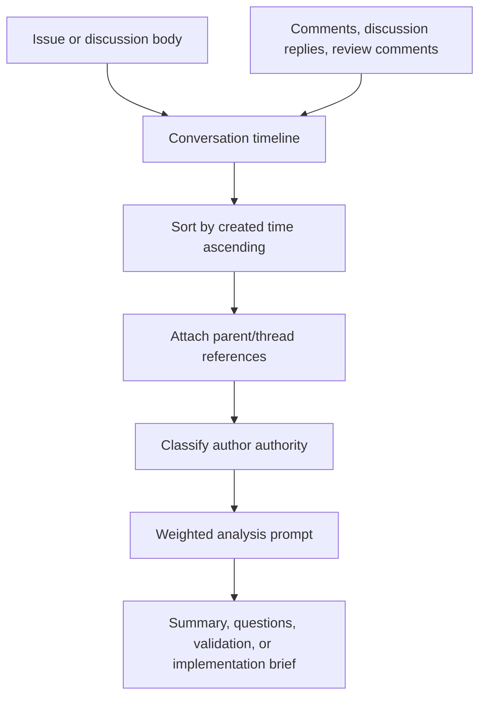
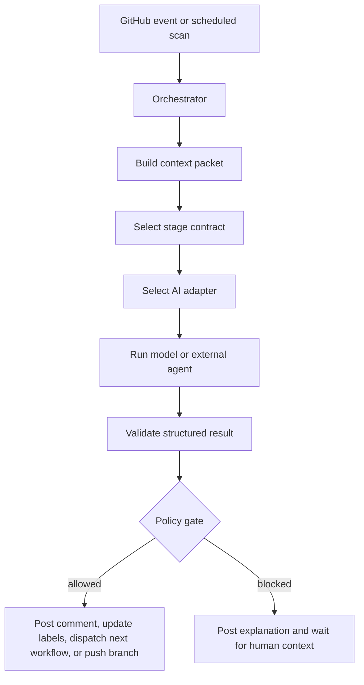

# AI Architecture

## Context Assembly And Analysis

All investigation, summarization, validation, and refinement runs must build context from the full GitHub conversation, not just the initial description.



Context assembly rules:

- Include the issue or discussion title and body first.
- Include all issue comments, discussion comments, discussion replies, pull request comments, and pull request review threads relevant to the current stage.
- Include `source.comment` metadata when the run was triggered by a command comment. The model should answer that source directly; deterministic GitVibe publishing decides whether the target supports a true threaded reply or needs a flat comment with a source link.
- Sort every item by creation time ascending. For threaded discussion replies, preserve the parent comment reference while still making the final analysis timeline chronological.
- Include author, author association, repository permission when available, timestamp, URL, reactions, and whether the comment was authored by GitVibe or another bot.
- Treat newer maintainer clarification as stronger than older lower-authority speculation, but do not discard contributor or guest reports; they may contain reproduction details.
- Weight analysis by authority: admin/owner/maintain > write/collaborator/member > contributor > first-time contributor/guest/none.
- When repository permission and `author_association` disagree, repository permission is stronger for approval and command authorization; `author_association` remains useful analysis metadata.

The same context assembly and weighted analysis pipeline applies to bug investigation, feature discussion refinement, validation, and PR feedback handling.

## Stage Contracts

GitVibe should treat AI as a set of stage-specific workers behind stable contracts. The GitVibe server/orchestrator owns permissions, state transitions, labels, workflow dispatch, and traceability. AI workers only produce structured recommendations, comments, code changes, or review results for the stage they are assigned.



AI integration layers:

- Orchestrator: deterministic code that validates actor permissions, reads config, builds context, enforces stage gates, and writes GitHub state.
- Context builder: gathers issue/discussion/PR timelines, repo snapshots, relevant files, reactions, workflow history, and linked artifacts into a stage-specific context packet.
- Stage contracts: typed task definitions for investigation, refinement, validation, implementation, review, and feedback remediation.
- AI adapter: `ai-sdk-agentool` is the primary adapter for all AI SDK-backed work. Structured-only stages use the same adapter with no tools or read-only tools.
- CLI adapters: `cli-codex` and `cli-claude-code` run their CLIs in non-interactive mode, stream CLI output to the action log, and parse structured output.
- External mention adapter: optional GitHub-visible comments to Codex, Claude, Copilot, or similar apps.
- Result validator: checks that AI output matches the stage schema, references the supplied context, and does not request disallowed actions.

Initial stage contracts:

| Stage                   | Access                             | Output                                                                       | May advance state                            |
| ----------------------- | ---------------------------------- | ---------------------------------------------------------------------------- | -------------------------------------------- |
| Triage classification   | Read issue/discussion only         | Suggested type, labels, confidence, missing info                             | No, except safe labels if configured         |
| Bug investigation       | Read repo and issue timeline       | Findings, suspected areas, blocking questions, concrete implementation plan  | No code changes                              |
| Feature refinement      | Read repo and discussion timeline  | Summary, proposed behavior, open questions, risks, acceptance criteria draft | No issue creation without protected approval |
| Validation              | Read repo and accepted context     | Pass/fail, contradictions, implementation brief                              | May mark ready only if policy allows         |
| Implementation          | Write `git-vibe/{root-issue}` only | Commits, test output, implementation summary                                 | May create/update branch, not merge          |
| Review matrix           | Read branch and diff               | Findings by reviewer role, pass/fail, required fixes                         | May create `gvi:review-fix` follow-up issues |
| PR feedback remediation | Write existing branch only         | Fix commits or skipped-comment rationale                                     | May update PR branch, not approve/merge      |

AI result envelope:

```json
{
  "stage": "investigate",
  "status": "blocked",
  "confidence": 0.74,
  "summary": "...",
  "findings": [],
  "blocking_questions": ["What expected behavior should implementation preserve?"],
  "questions": [],
  "assumptions": [],
  "proposed_labels": [],
  "next_state": "needs-info",
  "comment_body": "...",
  "references": []
}
```

## Execution Rules

- AI cannot authorize itself. Approval, merge, protected-label acceptance, and release decisions always require admin/collaborator authority.
- Read-only stages must not perform GitHub writes or use repo mutation tools.
- Implementation and feedback stages run on isolated branches and may use the configured repository PAT only for deterministic GitHub writes performed by GitVibe code.
- GitHub writes are deterministic code operations. AI returns a structured result envelope; GitVibe validates it, renders comments, updates labels, links artifacts, and dispatches workflows.
- Every AI comment should include a concise summary, concrete evidence/references, unresolved questions, and the next expected human action.
- Investigation can hand off to implementation only when `next_state` is `ready-for-implementation`, `blocking_questions` is empty, and `implementation_plan` is non-empty. Blocking maintainer decisions must not be hidden in general `questions`.
- If the AI is uncertain, finds contradictory maintainer guidance, or cannot map the request to the repository, it must stop and ask for context instead of inventing behavior.
- AI outputs must be parsed as structured data first; the human-facing comment is rendered from the validated result.
- Prompt templates and result schemas should be versioned so old workflow runs remain understandable.
- System and user prompt templates live under `prompts/<stage>/`. User prompts use XML sections for GitHub context, repository context, stage contract, and output schema.
- Stage output contracts live under `schemas/stages/` as JSON Schema files. Runner code binds each schema to `createOutputValidator` from `agentool/output-validator` and validates the final JSON again before deterministic writes.

## Provider Strategy

- v1 should implement `ai-sdk-agentool` using Vercel AI SDK, `agentool` 1.4.x, provider SDKs, and Zod schemas.
- Provider support should include OpenAI, Anthropic, and OpenAI-compatible custom endpoints through the same config shape.
- Additional providers should be added behind the same adapter contract, not by changing workflow stages.
- External apps such as Codex, Claude, and Copilot are mention partners. GitVibe may invoke them with configured comments and ingest their visible replies, but GitVibe should not depend on private third-party state or assume they respond to bot mentions.
- Local/self-hosted model support can use the same adapter interface when operators provide an endpoint and credentials.

CLI authentication guidance:

- API-key based OpenAI, Anthropic, OpenAI-compatible proxy, or Codex API style providers should go through `ai-sdk-agentool`.
- AI profiles should read provider auth, endpoints, and provider-specific CLI env from the `GITVIBE_AI_ENV_JSON` bundle secret.
- Codex CLI should use `auth_json.from_bundle` or a pre-seeded persistent `CODEX_HOME/auth.json` on a trusted self-hosted runner.
- Claude Code CLI should use `env.CLAUDE_CODE_OAUTH_TOKEN.from_bundle` for OAuth sessions. Do not use undocumented `CLAUDE_CODE_AUTH_TOKEN` as the planned env name.
- Reusable workflows install Codex CLI or Claude Code only when the selected stage profile uses `cli-codex` or `cli-claude-code`.

## Profile-Based Routing

GitVibe routes AI work through named profiles. A profile owns the adapter,
auth source, model, reasoning settings, generation defaults, and provider-specific
escape hatches. Each AI stage must choose one profile or an ordered profile list;
GitVibe fails fast when a stage does not define `profile` or `profiles`.

```yaml
ai:
  profiles:
    local_proxy:
      adapter: ai-sdk-agentool
      # Optional: set to the selected model's context window to log context_used_pct.
      # context_window_tokens: 128000
      provider:
        type: openai-compatible
        # Prefer direct model names when each profile should choose its own model.
        model: glm-5
        base_url:
          from_bundle: GITVIBE_AI_BASE_URL
        api_key:
          from_bundle: GITVIBE_AI_API_KEY
      reasoning:
        effort: high

    codex_cli:
      adapter: cli-codex
      auth_json:
        from_bundle: CODEX_AUTH_JSON
      model: gpt-5.3-codex
      reasoning:
        effort: high
        summary: concise

    claude_code:
      adapter: cli-claude-code
      env:
        CLAUDE_CODE_OAUTH_TOKEN:
          from_bundle: CLAUDE_OAUTH_TOKEN
      model: opus
      # Optional: use Claude Code's minimal mode for API-key or third-party provider setups.
      # Do not use bare mode for OAuth/keychain sessions.
      bare: false
      reasoning:
        effort: xhigh

  stages:
    investigate:
      profile: codex_cli
    materialize:
      profile: codex_cli
    create-pr:
      profile: codex_cli
    review-matrix:
      profiles:
        - codex_cli
```

Normalized reasoning config:

- `reasoning.effort`: `none`, `minimal`, `low`, `medium`, `high`, `xhigh`, `max`, or `auto`. Adapters should reject unsupported values for the selected provider/model with a clear config error.
- `reasoning.summary`: `auto`, `concise`, `detailed`, or `none` where the adapter supports summaries.
- `context_window_tokens`: optional positive integer on an AI profile. When set, `ai-sdk-agentool` logs per-step `context_used_pct` from reported input tokens.
- `provider.api_key.from_bundle`: AI SDK provider API key inside `GITVIBE_AI_ENV_JSON`.
- `provider.base_url.from_bundle`: AI SDK provider base URL inside `GITVIBE_AI_ENV_JSON`; required for OpenAI-compatible endpoints and optional for native OpenAI.
- `env.<NAME>.from_bundle`: CLI-only mapping from a key inside `GITVIBE_AI_ENV_JSON` to the spawned CLI process env.
- `auth_json.from_bundle`: `cli-codex` key inside `GITVIBE_AI_ENV_JSON`; GitVibe writes this value to temporary `CODEX_HOME/auth.json`.
- `provider_options`: adapter-specific passthrough for settings GitVibe does not normalize yet.
- `ai.budgets.max_context_window_tokens`: positive integer context budget for `ai-sdk-agentool` compaction and context usage logs. Default: `200000`.

Adapter mappings:

- `cli-codex`: map `reasoning.effort` to Codex `model_reasoning_effort`; map `reasoning.summary` to `model_reasoning_summary`.
- `cli-claude-code`: pass strict JSON Schema with `--json-schema`; map `reasoning.effort` to `--effort`; set `bare: true` to add Claude Code's `--bare` minimal mode when the runner uses API-key or third-party provider auth instead of OAuth/keychain auth.
- CLI adapters do not receive GitVibe stage tool lists or `max_turns`; Codex and Claude Code own their native tool loop and run without per-tool permission prompts in this workflow.
- `ai-sdk-agentool` with OpenAI: map `reasoning.effort` to `providerOptions.openai.reasoningEffort`; map summaries to `providerOptions.openai.reasoningSummary` where applicable.
- `ai-sdk-agentool` with Anthropic: map `reasoning.effort` to `providerOptions.anthropic.effort`; keep lower-level `thinking` config under `provider_options.anthropic` for explicit advanced use.

Tool policy by stage:

- triage: no tools, GitHub context only.
- investigation/refinement/validation: read, grep, glob, limited read-only bash, web fetch, web search.
- implementation: read, grep, glob, edit, write, multi-edit, bash, diff.
- review: read, grep, glob, read-only bash/test commands, diff.
- PR feedback remediation: implementation tools scoped to the existing PR branch.

Default AI budgets:

- default max turns: `90`.
- implementation and PR feedback max turns: `120`.
- validation repair max turns: `45` per repair attempt for `ai-sdk-agentool`; CLI adapters own their native loop.
- validation repair attempts: `3` per implementation run.
- review-fix continuation depth limit: `5` review-fix issues before GitVibe blocks and asks for human intervention.
- provider API request retries: `3` retries with a `60` second default delay; `429` retry headers override the default delay when present.
- ai-sdk-agentool context window: `200000` estimated tokens, with compaction before a model call when messages reach `90%` of the configured window.
- investigation/refinement/validation/review timeout: `60` minutes.
- implementation and PR feedback timeout: `120` minutes.
- PR creation/linking timeout: `15` minutes.
