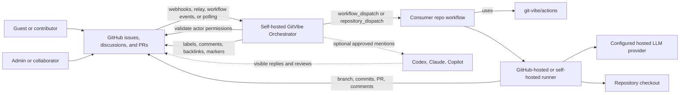
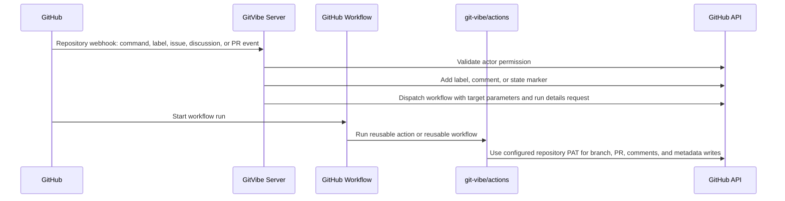
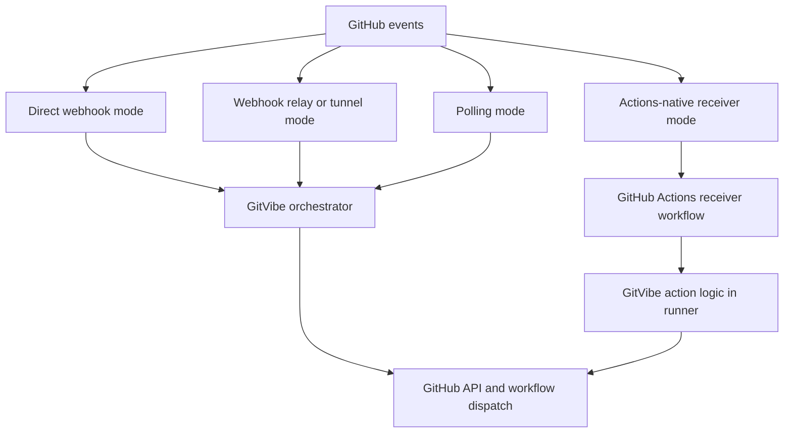

# Architecture

## Summary

GitVibe is a self-hostable repository webhook server plus reusable GitHub Actions/workflows for turning GitHub issues, discussions, labels, and pull requests into an AI-assisted development pipeline.

The public action namespace should be:

```yaml
uses: git-vibe/actions/investigate@main
```

Reusable full pipelines should be published from the same repository:

```yaml
jobs:
  git-vibe-develop:
    uses: git-vibe/actions/.github/workflows/develop.yml@main
```

Consumer repositories can run jobs on GitHub-hosted runners or self-hosted runners. The GitVibe orchestrator is hosted by the repository owner, receives or polls GitHub events, validates permissions, updates GitHub-native state, and dispatches workflows with parameters.

## Runtime Boundaries

GitVibe uses one package and one lockfile, but source is separated by runtime ownership:

- `src/app`: webhook server and repository orchestration logic that ships in the self-hosted Docker image.
- `src/runner`: reusable action runtime, AI stage execution, context assembly, prompt/schema handling, branch writes, PR creation, and result comments.
- `src/shared`: GitHub API helpers, Discussion helpers, labels, stage definitions, traceability helpers, and common types used by both app and runner.

The Docker image builds only app/shared output. Composite actions build the runner bundle on the GitHub runner before executing a stage. Runner-only changes should not deploy the app unless they also change shared code, package metadata, Docker/deploy files, or app code.

## System Shape



## Webhook And Token Model

The self-hosted server is the orchestrator. The reusable actions and workflows are execution workers. Repository owners configure a GitHub repository webhook and provide a fine-grained PAT to their own server.



Use `GITHUB_TOKEN` only for simple read operations. Use the self-hosted server's fine-grained PAT when GitVibe must trigger follow-up workflows, push branches, create pull requests, or avoid `GITHUB_TOKEN` event recursion limits.

The PAT is long-lived, so GitVibe should keep it narrowly scoped to the managed repository and store it only as a GitHub Actions secret plus the self-hosted server runtime secret. Workflows use the same configured PAT for deterministic GitHub writes and must never log or render the token.

Webhook dispatch includes serialized source metadata when automation came from an issue comment, Discussion comment, pull request conversation comment, or submitted pull request review. Runner publishing uses that metadata to choose Discussion `replyToId` or flat issue/PR comments with a source link. Pull request review-comment replies remain supported for existing metadata, but automatic feedback remediation is triggered by trusted `changes_requested` review submissions rather than individual review-comment webhooks.

Supported workflow auth modes:

- `webhook-pat`: default self-hosted mode. The server receives repository webhooks and uses a fine-grained PAT scoped to the managed repository.
- `pat`: local fallback where workflows receive a repository PAT directly as `GITVIBE_GITHUB_TOKEN`.

## Event Delivery Modes

Repository webhooks are the production event source when the operator has a reachable HTTPS endpoint. GitHub does not provide a first-party persistent stream where a private client dials out to subscribe to all repository events. GitVibe must therefore support several delivery modes.



Supported modes:

- `webhook`: production default and first implemented mode. GitHub sends repository webhooks to a public HTTPS URL owned by the operator.
- `relay`: deferred no-domain operator mode. GitHub sends webhooks to a relay such as Smee, Hookdeck, Cloudflare Tunnel, ngrok, or a self-hosted relay; the local GitVibe process keeps an outbound connection to receive events.
- `actions`: deferred no-server mode. Consumer repositories install lightweight receiver workflows triggered by GitHub events and scheduled scans.
- `polling`: deferred lowest-infrastructure mode. A local or scheduled GitVibe worker periodically queries issues, discussions, comments, reactions, labels, and workflow runs using ETags/cursors.

Recommended defaults:

- Managed or organization deployment: `webhook`.
- Local development: `relay` with Smee or an equivalent tunnel.
- Users with no stable domain and no relay provider: `actions`.
- Reaction-threshold scans: `actions` schedule or `polling`, because reactions do not provide a dependable standalone trigger for every threshold crossing.

Example config shape:

```yaml
event_delivery:
  mode: webhook # webhook | relay | actions | polling
  relay:
    provider: smee
    url_secret: GITVIBE_RELAY_URL
  actions_receiver:
    enabled: false
    scheduled_scan: "*/15 * * * *"
  polling:
    enabled: false
    interval_seconds: 300
```

## Consumer Setup

Consumer repositories do not clone GitVibe's internal action implementation. They copy a small starter `.github` folder and reference GitVibe's public reusable workflows by branch during pre-release setup. After a release tag exists, consumers can pin to that tag.

Copy source:

```text
examples/consumer/.github
```

Copy destination:

```text
<consumer-repo>/.github
```

Starter files:

- `.github/git-vibe.yml`: repository-specific GitVibe config.
- `.github/workflows/investigate.yml`: wrapper for investigation-only runs.
- `.github/workflows/develop.yml`: wrapper for full implementation runs.
- `.github/workflows/address-feedback.yml`: wrapper for PR feedback remediation.

The wrapper workflows call reusable workflows such as:

```yaml
jobs:
  develop:
    uses: git-vibe/actions/.github/workflows/develop.yml@main
```

Required repository or organization secrets/variables:

- `GITVIBE_GITHUB_TOKEN`: fine-grained PAT used by the server and workflows for GitHub API access.
- `WEBHOOK_SECRET`: repository webhook shared secret used by the deploy workflow to set runtime `GITHUB_WEBHOOK_SECRET`.
- `GITVIBE_AI_ENV_JSON`: JSON bundle for AI provider auth, endpoints, CLI auth, and provider-specific environment values.
- `GITVIBE_DISCUSSION_CATEGORY`, `GITVIBE_RUNNER`, `GITVIBE_LOG_LEVEL`: optional variables.

Self-hosted server runtime secrets:

- `GITHUB_WEBHOOK_SECRET`: webhook shared secret. In GitHub Actions deployment, this comes from repository secret `WEBHOOK_SECRET`.
- `GITVIBE_GITHUB_TOKEN`: mapped to runtime `GITVIBE_GITHUB_TOKEN`.

Self-hosted server variables:

- `GITVIBE_DISCUSSION_CATEGORY`: preferred Discussion category for converted feature issues, default `Ideas`.
- `GITHUB_REPOSITORY`: optional `owner/repo` used by startup preflight. GitHub Actions provides this automatically during deployment; operators do not create a secret or repository variable for it.
