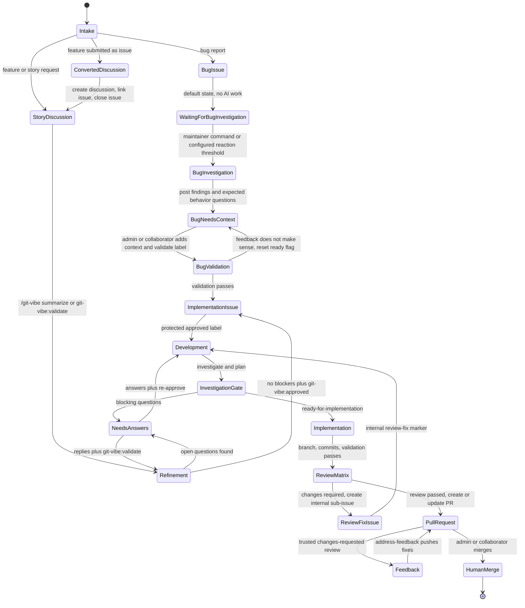
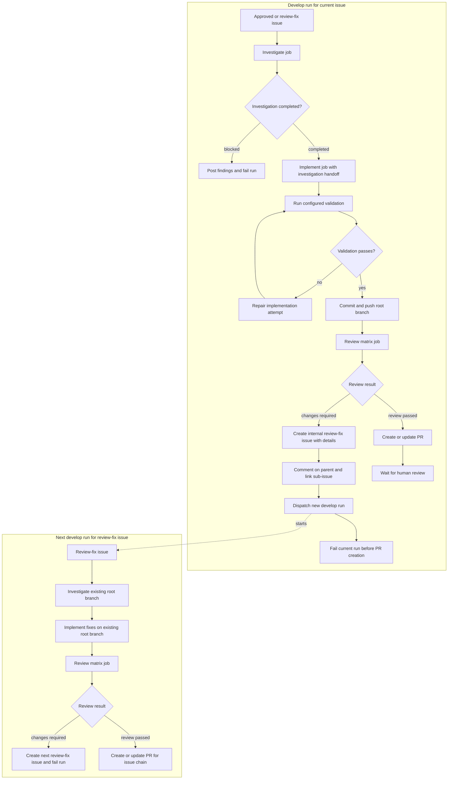
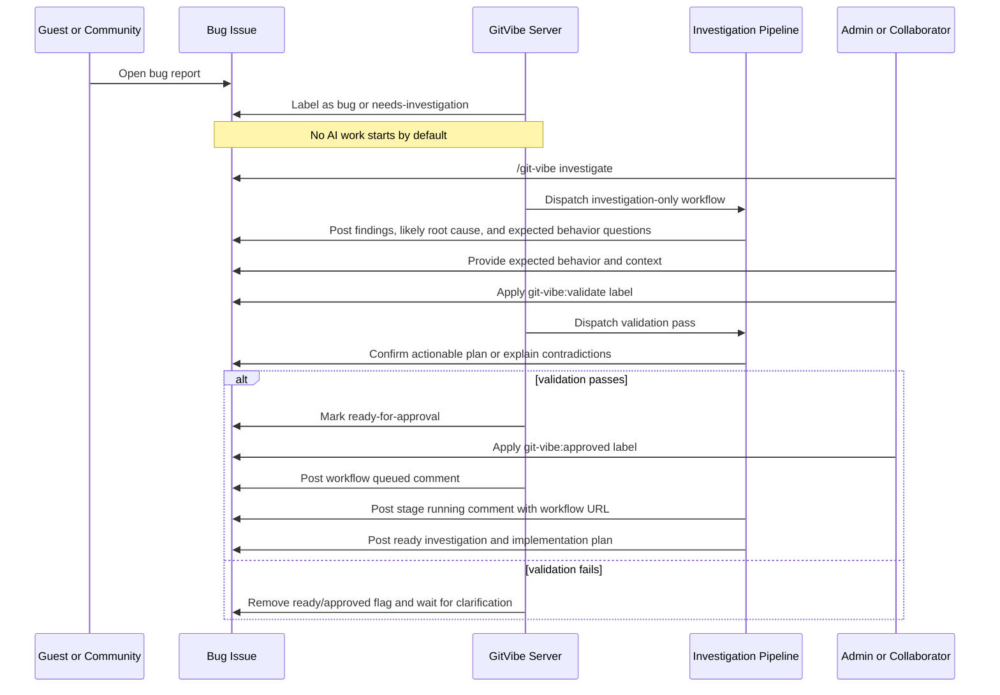
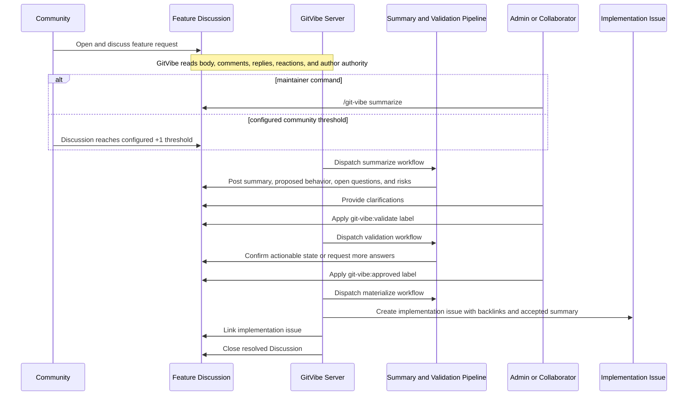
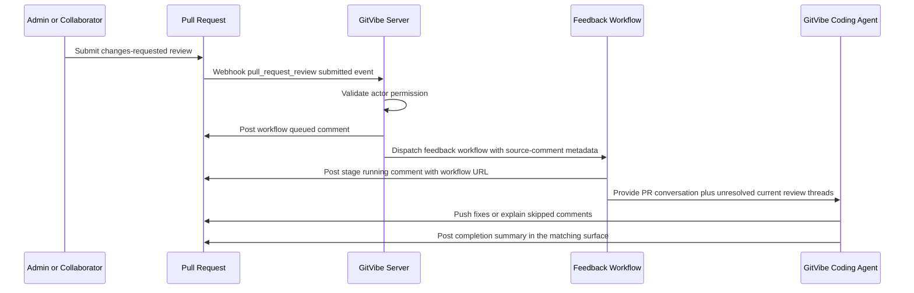

# Workflow

## Lifecycle



## Key Behavior

- Bugs remain issues.
- New bug issues do not automatically start AI work by default.
- Bug fixing is always gated: investigate first, post findings, ask for expected behavior, wait for admin/collaborator context, validate that context, then approve implementation.
- If validation does not make sense, GitVibe aborts the session, posts its concern, removes the ready/approved automation flag, and waits for more clarification.
- Stories and feature requests begin as discussions.
- Feature requests opened through the feature request issue form are converted by creating a discussion, linking back, labeling the issue as needing discussion, and closing the issue.
- Admins and collaborators move work forward with public `/git-vibe ...`
  commands and protected labels.
- Accepted commands from admins and collaborators receive a `rocket` reaction before GitVibe dispatches the workflow.
- Command, protected-label, and trusted-review dispatches post a queued comment after dispatch succeeds. Queued comments include the exact workflow run URL when GitHub returns it. Runner stages remove prior transient queued/running GitVibe status comments for the same artifact before posting the next running or result comment.
- Guests can submit issues, discussions, and feedback, but cannot approve work or start write automation.
- Consumer repositories may opt into community-triggered bug investigation using a reaction threshold, such as six `+1` reactions. This can only start investigation and summary generation; it must never start code changes.
- GitVibe never auto-merges and never approves its own pull requests.
- External agents are optional mention partners. GitVibe may post commands like `@codex review` or `@claude ...` only after admin/collaborator opt-in or explicit config.

## Public Interfaces

Consumer config lives at:

```text
.github/git-vibe.yml
```

Initial commands:

```text
/git-vibe summarize
/git-vibe investigate
/git-vibe address-feedback
```

GitVibe uses `/git-vibe ...` as the only public command form. `@git-vibe ...` is intentionally unsupported so commands do not look like GitHub account mentions. GitHub does not currently provide a stable custom repository command autocomplete contract, so command parsing must work from plain comment text.

Initial labels:

```text
git-vibe:story
git-vibe:bug
git-vibe:needs-discussion
git-vibe:needs-investigation
git-vibe:investigating
git-vibe:investigation-complete
git-vibe:needs-expected-behavior
git-vibe:approval-requested
git-vibe:ready-for-approval
git-vibe:approved
git-vibe:validate
git-vibe:in-progress
git-vibe:blocked
git-vibe:pr-opened
```

Internal runtime labels:

```text
gvi:review-fix
```

`gvi:` labels are private GitVibe runtime labels. Maintainers should not add them
manually; GitVibe creates missing managed labels on app startup and on the first
webhook seen for a repository.

### Fine-Grained PAT Permissions

Required fine-grained PAT repository permissions:

| Permission    | Access     | Required for                                                         |
| ------------- | ---------- | -------------------------------------------------------------------- |
| Metadata      | Read       | Repository lookup, collaborator checks, and metadata                 |
| Variables     | Read       | Reading GitHub Actions repository variables                          |
| Actions       | Read/write | Workflow dispatch, workflow runs, and artifacts                      |
| Contents      | Read/write | Contents, commits, branches, releases, and merges                    |
| Discussions   | Read/write | Discussions, comments, and discussion labels                         |
| Issues        | Read/write | Issues, comments, assignees, labels, and milestones                  |
| Pull requests | Read/write | Pull requests, comments, assignees, labels, and merges               |
| Secrets       | Read/write | Updating `GITVIBE_AI_ENV_JSON` after Codex CLI refreshes `auth.json` |
| Workflows     | Read/write | Updating GitHub Actions workflow files                               |

Only `Metadata` and `Variables` are always read-only. `Secrets` needs read/write
access only when a `cli-codex` profile uses `auth_json.from_bundle`; GitVibe
then writes refreshed Codex auth back to the repository `GITVIBE_AI_ENV_JSON`
secret. Every other listed permission needs read/write access.

GitHub labels are not natively protected per label. GitVibe must treat public
automation labels and internal `gvi:` labels as protected by policy: only
configured admin/collaborator roles may add or remove them, and the server must
verify the webhook sender on every relevant label event before dispatching
automation. If an unauthorized actor adds a protected `git-vibe:*` label,
GitVibe removes the label, posts an audit comment, and does not start the
pipeline. If anyone adds `gvi:review-fix` without a valid GitVibe hidden marker,
GitVibe removes it.

## Pipeline



Review matrix defaults:

- correctness review
- test coverage review
- security and regression review
- maintainability review

The implementation stage has an inner validation repair loop. GitVibe runs the
configured `tests.commands` mechanically after the AI returns JSON. If a command
fails, GitVibe feeds the failed command, bounded stdout/stderr excerpts, git
status, and diff stat back into the implementation stage for a bounded repair
attempt before any commit is created. `validation_repair_attempts` is scoped to
one implementation run, and each repair attempt gets
`validation_repair_max_turns` turns for adapters that support turn limits.

The review matrix is a separate gate after implementation. Review findings must
be evidence-backed required fixes; speculative or over-engineering suggestions
are non-blocking. When review returns `changes-required`, GitVibe posts a brief
comment on the current issue, creates a `gvi:review-fix` issue containing the
detailed review findings, links it as a native sub-issue, and dispatches another
development run, then the current run fails before PR creation. Review-fix runs
start from investigation again, checkout the existing root implementation branch
when its hidden marker names one, and implement only the required review fixes.
When a review-fix run eventually returns `review-passed`, that later run creates
or updates the pull request for the full issue chain.

## Bug Investigation Flow

Bug reports have a separate investigation-only path before implementation. The goal is to let AI help summarize reproduction evidence, likely affected code, suspected root cause, missing information, and expected behavior questions without changing code.

In the `develop` workflow, investigation is a hard gate. Implementation runs
only when investigation returns `ready-for-implementation`, no blocking
questions, and a concrete implementation plan. A not-ready investigation posts
its findings and blocking questions, removes `git-vibe:approved`, adds
`git-vibe:blocked`, and stops implementation. Maintainers answer the questions
and re-add `git-vibe:approved` to retry the gate. A ready investigation is
persisted as a handoff artifact so implementation receives the investigation
summary, findings, and concrete implementation plan directly in its stage
context.
Human-facing investigation and validation comments stay concise; full structured
stage output remains available in the workflow result artifact and, for develop
runs, in handoff artifacts consumed by later stages.



Community-triggered investigation is optional and configured per repository. Because GitHub reactions are API-readable but are not a reliable standalone workflow trigger, GitVibe should evaluate reaction thresholds during issue events, comment events, and/or a scheduled scan. The threshold path may only dispatch the investigation-only workflow.

Example config shape:

```yaml
bug_investigation:
  auto_start_on_new_bug: false
  community_trigger:
    enabled: true
    reaction: "+1"
    threshold: 6
    eligible_labels:
      - git-vibe:bug
    dispatch: investigation-only
```

## Feature Refinement Flow

Feature discussions use the same weighted full-conversation analysis as bugs. The goal is to convert a long discussion into an actionable implementation issue only after behavior, scope, constraints, and acceptance criteria are clear.



Community-triggered feature refinement is optional and configurable. It may automatically start summarization for high-signal discussions, but it must not validate, create implementation issues, or start coding without admin/collaborator approval.

Example config shape:

```yaml
feature_refinement:
  community_trigger:
    enabled: true
    reaction: "+1"
    threshold: 10
    dispatch: summarize
```

## PR Feedback Loop

Pull request feedback remediation is a separate single-stage workflow, not the
full `develop.yml` investigation, review-matrix, and PR creation sequence. It
adds PR conversation and review-thread context, checks out the existing PR
branch, applies actionable feedback, pushes fix commits, and posts a completion
summary back to the triggering surface.



Admins and collaborators can also run `/git-vibe address-feedback` in the pull
request conversation as a manual retry path. Individual review-comment webhooks
do not dispatch automation; GitVibe waits for the submitted review state and
only treats trusted `changes_requested` reviews as the automatic signal.

## Linking And Traceability

GitVibe must make every generated artifact discoverable from the others.

- When a feature issue is converted to a discussion, the closed issue gets a comment linking the discussion, and the discussion body or first bot comment links the original issue.
- When a discussion becomes an implementation issue, the issue body links the source discussion, the issue gets `git-vibe:story`, and the discussion gets a comment linking the implementation issue.
- Webhook-triggered command workflows carry `source-comment` metadata so result comments can target the triggering surface. Discussions use threaded replies; issue, pull request conversation, and submitted-review triggers use flat comments with an explicit source link. Pull request review-comment replies remain supported for existing metadata.
- When the app dispatches automation from a command, protected label, or trusted review, it posts a queued comment with a hidden metadata marker and the exact workflow run URL when GitHub returns it. When a runner stage actually starts, the runner posts a running comment containing the workflow run URL and a hidden metadata marker for the stage and source artifact. These queued/running comments are transient: GitVibe deletes matching prior transient status comments and keeps durable result, traceability, investigation, and validation comments.
- Implementation branches use the deterministic format `git-vibe/{root-issue-number}`. Review-fix issues carry a hidden marker that points back to the root branch.
- When a pull request is created, the PR body references the source issue chain. If the PR targets the repository default branch, use closing keywords such as `Closes #123`; if it targets a non-default branch, still include explicit issue links because GitHub closing keywords only create linked issues for default-branch PRs.
- The source issue gets a comment linking the PR and latest workflow run.
- PR feedback runs add comments linking the feedback workflow run, changed commits, and any review comments that were skipped with rationale.
- Prefer GitHub-native references (`#123`, full issue/discussion/PR URLs, and workflow run URLs) so GitHub creates backlinks and rich references where supported; use explicit bot comments where GitHub does not create a first-class link automatically.
