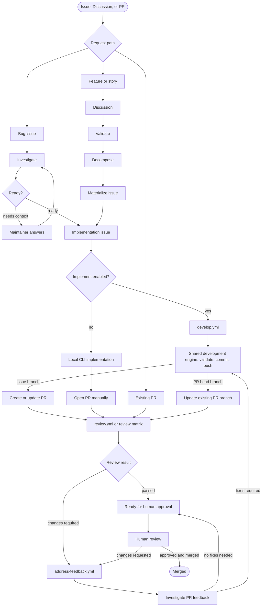
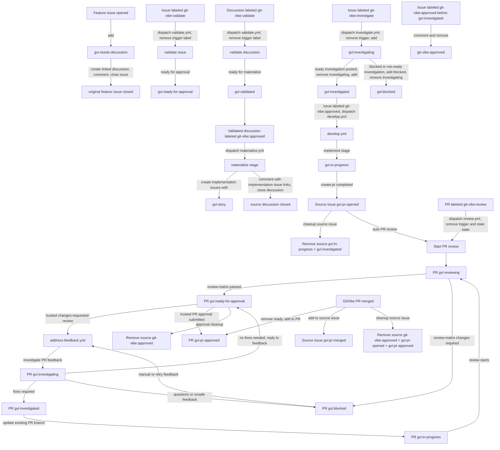
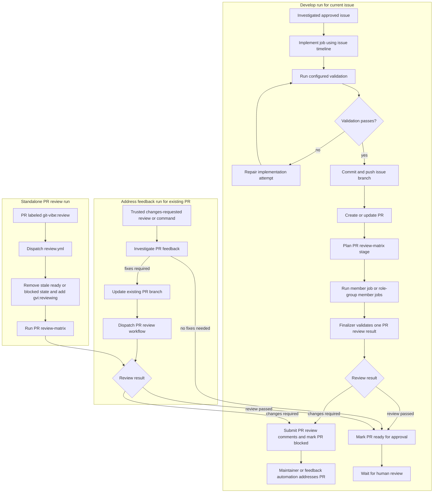
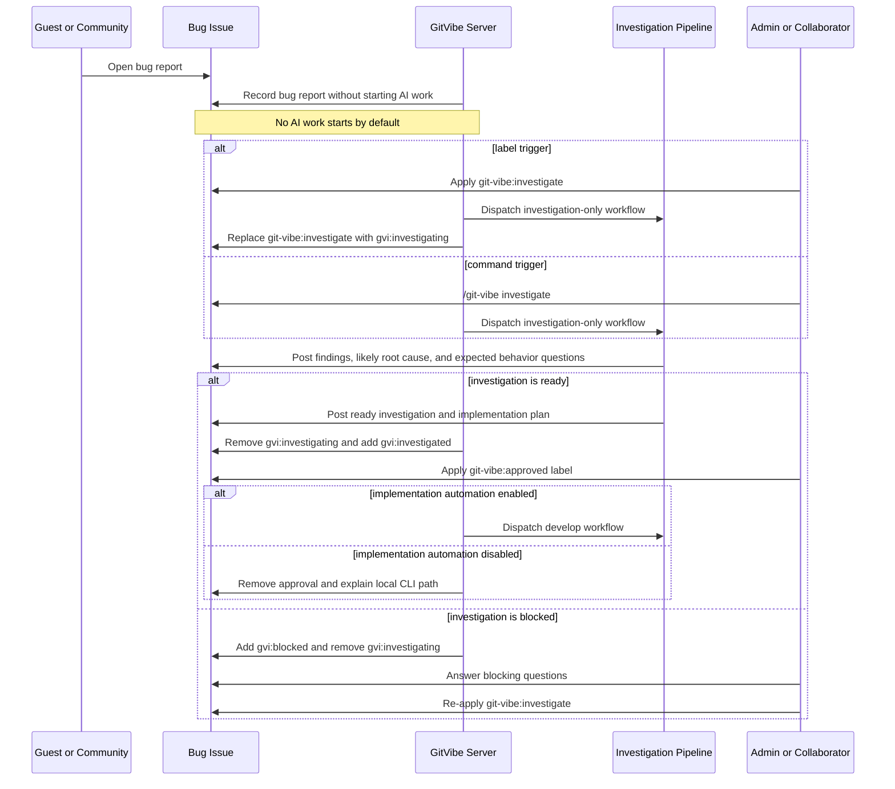
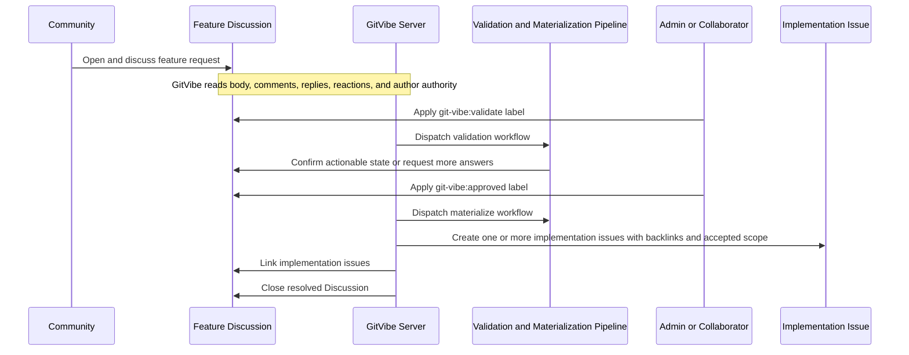
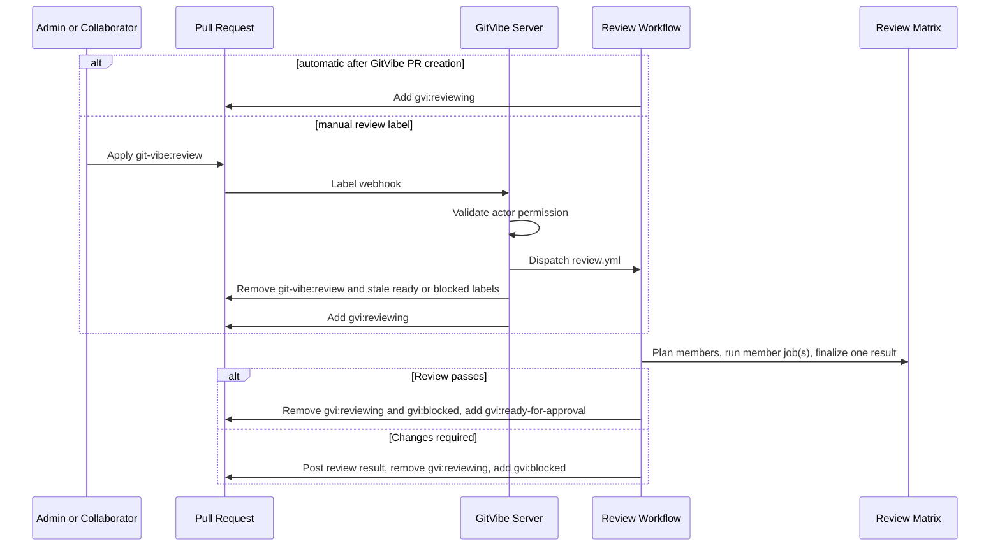
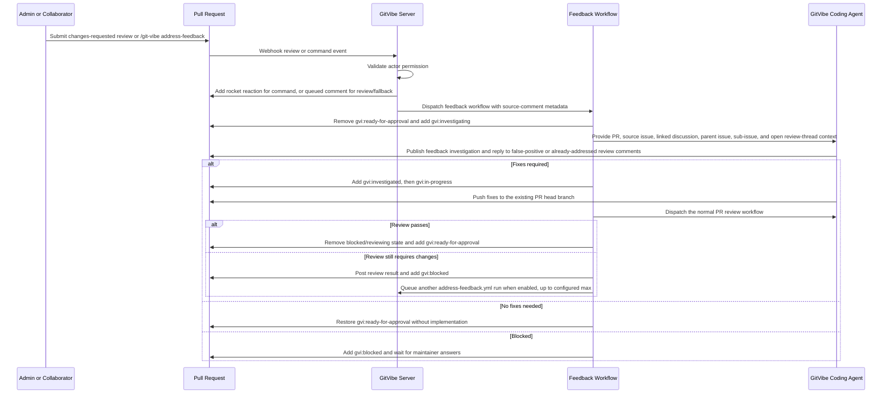

# Workflow

## Lifecycle



## Key Behavior

- Bugs remain issues.
- New bug issues do not automatically start AI work by default.
- Bug fixing is always gated: investigate first, post findings, ask for expected behavior, then approve implementation after `gvi:investigated` is present.
- If `git-vibe:approved` is added to an issue before `gvi:investigated`, GitVibe removes `git-vibe:approved` and comments with the required investigation step.
- If `ai.stages.implement.enabled` is `false`, GitVibe removes
  `git-vibe:approved` from investigated issues and leaves the ticket available
  for local CLI implementation.
- Issue implementation and PR feedback remediation share the same deterministic
  branch-update engine: validate, stage, commit, and push. They differ in
  orchestration and branch target: implementation uses `git-vibe/{root-issue}`;
  feedback remediation uses the existing PR head branch and never creates a PR.
- If validation does not make sense, GitVibe aborts the session, posts its concern, removes the ready/approved automation flag, and waits for more clarification.
- Stories and feature requests begin as discussions.
- Feature requests opened through the feature request issue form are converted by creating a discussion, linking back, labeling the issue as needing discussion, and closing the issue.
- Admins and collaborators move work forward with public `/git-vibe ...`
  commands and protected labels.
- Accepted comment commands from admins and collaborators receive a `rocket` reaction before GitVibe dispatches the workflow. If the reaction cannot be added, GitVibe posts a queued workflow comment as the visible fallback.
- Status updates prefer reactions, then labels, then comments. The issue
  `git-vibe:investigate` dispatch adds `gvi:investigating` instead of a
  queued comment; label-backed and review-backed dispatches include the exact workflow run URL
  when GitHub returns it. Runner stages remove prior transient queued/running
  GitVibe status comments for the same artifact before posting the next running
  or result comment.
- Guests can submit issues, discussions, and feedback, but cannot approve work or start write automation.
- GitVibe never auto-merges and never approves its own pull requests.
- External agents are optional mention partners. GitVibe may post commands like `@codex review` or `@claude ...` only after admin/collaborator opt-in.

## Public Interfaces

Consumer config lives at:

```text
.github/git-vibe.yml
```

Initial commands:

```text
/git-vibe investigate
/git-vibe address-feedback
```

GitVibe uses `/git-vibe ...` as the only public command form. `@git-vibe ...` is intentionally unsupported so commands do not look like GitHub account mentions. GitHub does not currently provide a stable custom repository command autocomplete contract, so command parsing must work from plain comment text.

Active label flow:



Active public trigger labels:

```text
git-vibe:validate
git-vibe:investigate
git-vibe:approved
git-vibe:review
```

Active internal runtime labels:

```text
gvi:needs-discussion
gvi:story
gvi:ready-for-approval
gvi:validated
gvi:validating
gvi:investigated
gvi:investigating
gvi:reviewing
gvi:blocked
gvi:in-progress
gvi:pr-opened
gvi:pr-approved
gvi:pr-merged
gvi:review-fix
```

`gvi:` labels are private GitVibe runtime labels. Maintainers should not add
them manually; GitVibe creates missing managed labels on app startup and on the
first webhook seen for a repository.

### Fine-Grained PAT Permissions

Required fine-grained PAT repository permissions:

| Permission    | Access     | Required for                                                         |
| ------------- | ---------- | -------------------------------------------------------------------- |
| Metadata      | Read       | Repository lookup, collaborator checks, and metadata                 |
| Variables     | Read       | Reading GitHub Actions repository variables                          |
| Actions       | Read/write | Workflow dispatch, workflow runs, and artifacts                      |
| Contents      | Read/write | Contents, commits, branches, releases, and merges                    |
| Discussions   | Read/write | Discussions, comments, and discussion labels                         |
| Issues        | Read/write | Issues, comments, assignees, labels, and milestones                  |
| Pull requests | Read/write | Pull requests, comments, assignees, labels, and merges               |
| Secrets       | Read/write | Updating `GITVIBE_AI_ENV_JSON` after Codex CLI refreshes `auth.json` |
| Workflows     | Read/write | Updating GitHub Actions workflow files                               |

Only `Metadata` and `Variables` are always read-only. `Secrets` needs read/write
access only when a `cli-codex` profile uses `auth_json.from_bundle`; GitVibe
then writes refreshed Codex auth back to the repository `GITVIBE_AI_ENV_JSON`
secret. Every other listed permission needs read/write access.

GitHub labels are not natively protected per label. GitVibe must treat public
trigger labels and internal `gvi:` labels as protected by policy: only
configured admin/collaborator roles may add or remove them, and the server must
verify the webhook sender on every relevant label event before dispatching
automation. If an unauthorized actor adds a protected `git-vibe:*` or `gvi:*`
label, GitVibe removes the label, posts an audit comment, and does not start the
pipeline. Known `gvi:*` runtime labels never dispatch workflows from label
events. If anyone adds `gvi:review-fix` without a valid GitVibe issue hidden
marker, GitVibe removes it. Issue follow-ups use `kind=issue`; pull request
feedback retries use hidden `kind=pull-request` markers for retry depth but do
not add `gvi:review-fix` to the PR.

## Pipeline



Review matrix role groups are configured through `ai.role_groups`. Each role
entry pairs a `.git-vibe/role-group/*.md` role definition with the AI profile
that runs it. The configured synthesizer profile receives the role definitions
and successful role outputs, can inspect repository context, and returns one
final `review-matrix.v1` result.

The implementation stage has an inner validation repair loop. GitVibe runs the
configured `tests.commands` mechanically after the AI returns JSON. If a command
fails, GitVibe feeds the failed command, bounded stdout/stderr excerpts, git
status, and diff stat back into the implementation stage for a bounded repair
attempt before any commit is created. `validation_repair_attempts` is scoped to
one implementation run, and each repair attempt gets
`validation_repair_max_turns` turns for adapters that support turn limits.

The review matrix is a separate PR-scoped gate after implementation and PR
creation. Review findings must be evidence-backed required fixes; speculative or
over-engineering suggestions are non-blocking. When review returns
`changes-required`, GitVibe submits a GitHub pull request review with inline
comments for anchorable findings, posts the compact review result on the pull
request, and marks the PR `gvi:blocked`. When review returns `review-passed`,
GitVibe removes stale blocked/reviewing state and marks the PR
`gvi:ready-for-approval`.
Maintainers can rerun review on any PR by applying `git-vibe:review`.

## Bug Investigation Flow

Bug reports have a separate investigation-only path before implementation. The
goal is to let AI help capture reproduction evidence, likely affected code,
suspected root cause, missing information, and expected behavior questions
without changing code.

Investigation is completed before the `develop` workflow starts. A trusted actor
can add `git-vibe:investigate` or run `/git-vibe investigate` to dispatch
`investigate.yml`; the label path removes `git-vibe:investigate` and adds
`gvi:investigating` after dispatch. A not-ready investigation posts its
findings and blocking questions, adds `gvi:blocked`, removes
`gvi:investigating`, and waits for maintainer answers. Maintainers answer
the questions and add `git-vibe:investigate` to retry. A ready investigation
posts the investigation result to the issue, removes `gvi:investigating`,
and adds `gvi:investigated`.

For issues, `git-vibe:approved` is valid only after `gvi:investigated` is
present. If approval is added too early, GitVibe removes `git-vibe:approved` and
comments with the required investigation step. The later `develop.yml`
implementation run reads the posted investigation result from the issue
timeline. Human-facing investigation and validation comments stay concise; full
structured stage output remains available in the workflow result artifact.
When `ai.stages.implement.enabled` is `false`, issue approval does not dispatch
`develop.yml`; GitVibe removes the approval label and leaves the issue ready for
local CLI work.



## Feature Refinement Flow

Feature discussions use the same weighted full-conversation analysis as bugs. The goal is to convert a long discussion into an actionable implementation issue only after behavior, scope, constraints, and acceptance criteria are clear.



## PR Review Flow

Pull request review can start automatically after `develop.yml` creates or
updates a PR, or manually when a trusted actor applies `git-vibe:review` to an
existing PR. The review workflow is read-only against the repository checkout;
GitVibe writes only labels and review result comments.



## PR Feedback Loop

Pull request feedback remediation is separate from the initial `develop.yml`
implementation and standalone `review.yml` review flows. It adds PR conversation
and review-thread context, checks out the existing PR branch, applies actionable
feedback, pushes fix commits, and posts a completion summary back to the
triggering surface. The coding step uses the same branch-update engine as issue
implementation, but it never creates or replaces the pull request.



Admins and collaborators can also run `/git-vibe address-feedback` in the pull
request conversation as a manual retry path. Individual review-comment webhooks
do not dispatch automation; GitVibe waits for the submitted review state and
only treats trusted `changes_requested` reviews as the automatic signal.
The reusable workflow runs `investigate` in PR-feedback mode first, skips coding
when no fixes are needed, and runs `address-pr-feedback` plus the normal PR
review workflow only for actionable feedback.

## Linking And Traceability

GitVibe must make every generated artifact discoverable from the others.

- When a feature issue is converted to a discussion, the closed issue gets a comment linking the discussion, and the discussion body or first bot comment links the original issue.
- When a discussion becomes an implementation issue, the issue body links the source discussion, the issue gets `gvi:story`, and the discussion gets a comment linking the implementation issue.
- Webhook-triggered command workflows carry `source-comment` metadata so result comments can target the triggering surface. Discussions use threaded replies; issue, pull request conversation, and submitted-review triggers use flat comments with an explicit source link. Pull request review-comment replies remain supported for existing metadata.
- When the app dispatches automation from a comment command, a successful `rocket` reaction is the acknowledgement and GitVibe does not also post a queued comment. Protected label dispatches, trusted review dispatches, and failed command reactions still use queued comments with hidden metadata and the exact workflow run URL when GitHub returns it. When a runner stage actually starts, the runner posts a running comment containing the workflow run URL and a hidden metadata marker for the stage and source artifact. These queued/running comments are transient: GitVibe deletes matching prior transient status comments and keeps durable result, traceability, investigation, and validation comments.
- Implementation branches use the deterministic format
  `git-vibe/{root-issue-number}`. PR feedback remediation does not create an
  issue branch; it pushes to the existing same-repository PR head branch.
- When a pull request is created, the PR body references the source issue chain. If the PR targets the repository default branch, use closing keywords such as `Closes #123`; if it targets a non-default branch, still include explicit issue links because GitHub closing keywords only create linked issues for default-branch PRs.
- When a pull request is opened by GitVibe, the source issue gets `gvi:pr-opened`, stale source `gvi:in-progress`, `gvi:investigated`, and `gvi:ready-for-approval` labels are removed, and PR-scoped review starts before the PR is marked ready.
- During PR review and feedback handling, the PR owns one active workflow-state label at a time among `gvi:reviewing`, `gvi:investigating`, `gvi:investigated`, `gvi:in-progress`, `gvi:blocked`, and `gvi:ready-for-approval`; the source issue remains at `gvi:pr-opened`.
- When PR feedback review still returns `changes-required`, the PR gets inline GitHub review comments for anchorable required fixes, a durable review-matrix result comment, and `gvi:blocked`; GitVibe queues another `address-feedback.yml` run when feedback automation is enabled, until the PR reaches `ai.budgets.pr_feedback_max_iterations` retry markers.
- When a trusted reviewer approves a GitVibe pull request, the PR gets `gvi:pr-approved`, PR `gvi:ready-for-approval` is removed, and stale source `git-vibe:approved` is removed.
- When a GitVibe pull request is merged before default-branch closure, the PR gets `gvi:pr-approved`, PR `gvi:ready-for-approval` is removed, the source issue gets `gvi:pr-merged`, and stale source workflow state labels are removed.
- The source issue gets a comment linking the PR and latest workflow run.
- PR feedback runs add comments linking the feedback workflow run, changed commits, and any review comments that were skipped with rationale.
- Prefer GitHub-native references (`#123`, full issue/discussion/PR URLs, and workflow run URLs) so GitHub creates backlinks and rich references where supported; use explicit bot comments where GitHub does not create a first-class link automatically.
