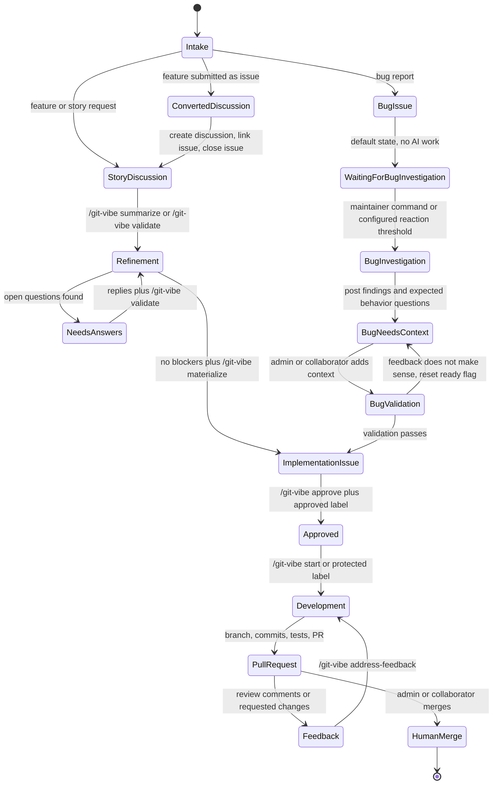
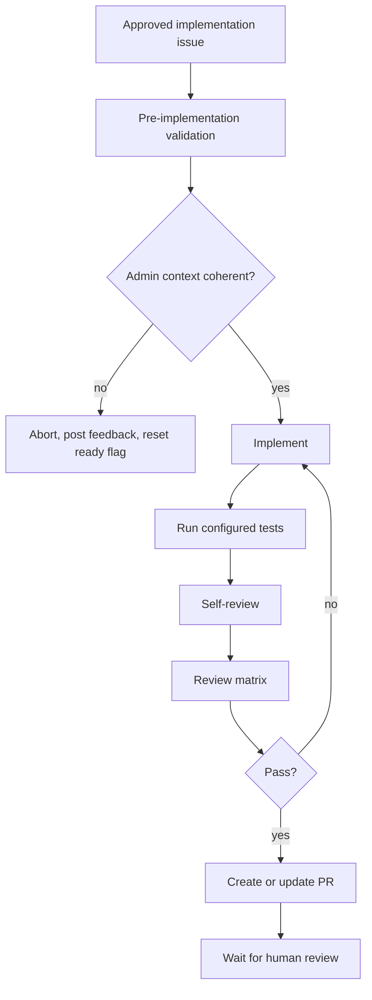
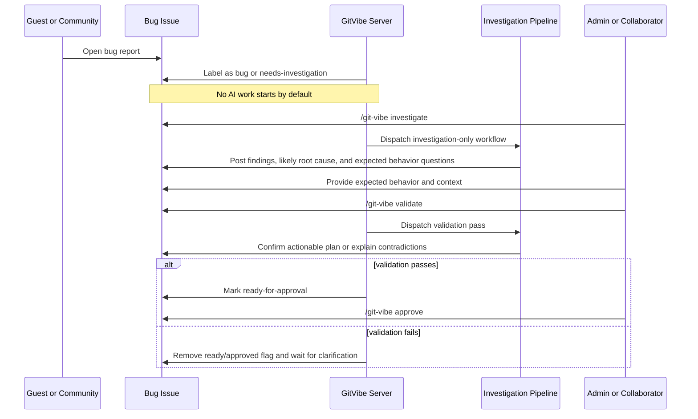
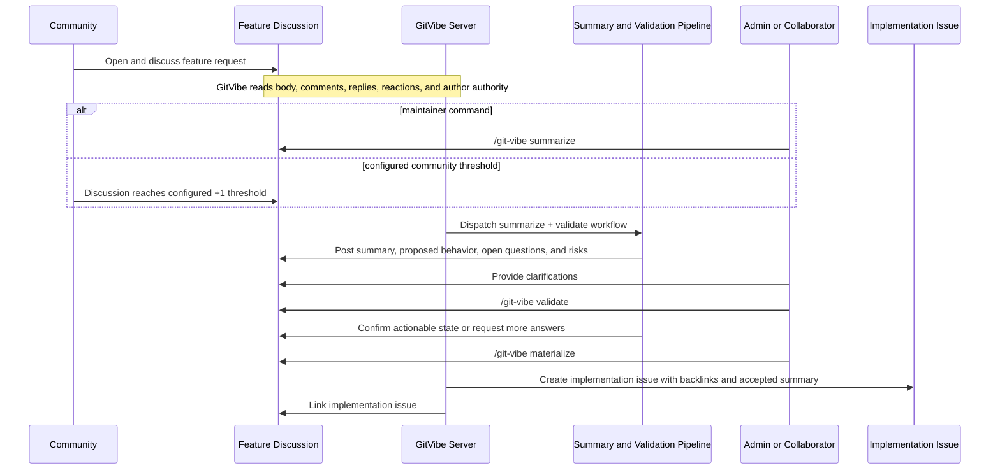
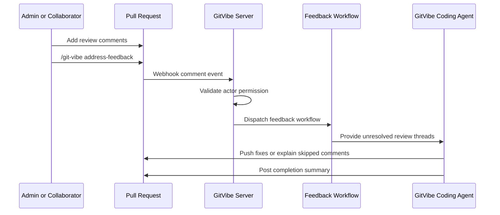

# Workflow

## Lifecycle



## Key Behavior

- Bugs remain issues.
- New bug issues do not automatically start AI work by default.
- Bug fixing is always gated: investigate first, post findings, ask for expected behavior, wait for admin/collaborator context, validate that context, then approve implementation.
- If the pre-implementation validation does not make sense, GitVibe aborts the session, posts its concern, removes the ready/approved automation flag, and waits for more clarification.
- Stories and feature requests begin as discussions.
- Feature requests opened through the feature request issue form are converted by creating a discussion, linking back, labeling the issue as needing discussion, and closing the issue.
- Admins and collaborators move work forward with commands plus labels.
- Accepted commands from admins and collaborators receive a `rocket` reaction before GitVibe dispatches the workflow.
- Guests can submit issues, discussions, and feedback, but cannot approve work or start write automation.
- Consumer repositories may opt into community-triggered bug investigation using a reaction threshold, such as six `+1` reactions. This can only start investigation and summary generation; it must never start code changes.
- GitVibe never auto-merges and never approves its own pull requests.
- External agents are optional mention partners. GitVibe may post commands like `@codex review` or `@claude ...` only after admin/collaborator opt-in or explicit config.

## Public Interfaces

Consumer config lives at:

```text
.github/git-vibe.yml
```

Initial commands:

```text
/git-vibe summarize
/git-vibe investigate
/git-vibe validate
/git-vibe materialize
/git-vibe approve
/git-vibe start
/git-vibe address-feedback
```

GitVibe uses `/git-vibe ...` as the only public command form. `@git-vibe ...` is intentionally unsupported so commands do not look like GitHub account mentions. GitHub does not currently provide a stable custom repository command autocomplete contract, so command parsing must work from plain comment text.

Initial labels:

```text
git-vibe:story
git-vibe:bug
git-vibe:needs-discussion
git-vibe:needs-investigation
git-vibe:investigating
git-vibe:investigation-complete
git-vibe:needs-expected-behavior
git-vibe:approval-requested
git-vibe:ready-for-approval
git-vibe:approved
git-vibe:in-progress
git-vibe:blocked
git-vibe:pr-opened
```

Required fine-grained PAT repository permissions:

```text
Metadata: read
Issues: read/write
Discussions: read/write
Pull requests: read/write
Contents: read/write
Actions: read/write
```

GitHub labels are not natively protected per label. GitVibe must treat approval labels as protected by policy: only configured admin/collaborator roles may add or remove approval labels, and the server must verify the webhook sender on every relevant label event before dispatching automation. If an unauthorized actor adds `git-vibe:approved`, GitVibe removes the label, posts an audit comment, and does not start the pipeline.

## Pipeline



Review matrix defaults:

- correctness review
- test coverage review
- security and regression review
- maintainability review

## Bug Investigation Flow

Bug reports have a separate investigation-only path before implementation. The goal is to let AI help summarize reproduction evidence, likely affected code, suspected root cause, missing information, and expected behavior questions without changing code.



Community-triggered investigation is optional and configured per repository. Because GitHub reactions are API-readable but are not a reliable standalone workflow trigger, GitVibe should evaluate reaction thresholds during issue events, comment events, and/or a scheduled scan. The threshold path may only dispatch the investigation-only workflow.

Example config shape:

```yaml
bug_investigation:
  auto_start_on_new_bug: false
  community_trigger:
    enabled: true
    reaction: "+1"
    threshold: 6
    eligible_labels:
      - git-vibe:bug
    dispatch: investigation-only
```

## Feature Refinement Flow

Feature discussions use the same weighted full-conversation analysis as bugs. The goal is to convert a long discussion into an actionable implementation issue only after behavior, scope, constraints, and acceptance criteria are clear.



Community-triggered feature refinement is optional and configurable. It may automatically start `summarize + validate` for high-signal discussions, but it must not create implementation issues or start coding without admin/collaborator approval.

Example config shape:

```yaml
feature_refinement:
  community_trigger:
    enabled: true
    reaction: "+1"
    threshold: 10
    dispatch: summarize-and-validate
```

## PR Feedback Loop



## Linking And Traceability

GitVibe must make every generated artifact discoverable from the others.

- When a feature issue is converted to a discussion, the closed issue gets a comment linking the discussion, and the discussion body or first bot comment links the original issue.
- When a discussion becomes an implementation issue, the issue body links the source discussion, the issue gets `git-vibe:story`, and the discussion gets a comment linking the implementation issue.
- When an investigation or development workflow starts, GitVibe posts a short issue/discussion comment containing the workflow run URL and a hidden metadata marker for the run id, stage, and source artifact.
- Implementation branches use the deterministic format `git-vibe/{issue-number}`. When a branch is created, GitVibe comments with the branch name and workflow run URL.
- When a pull request is created, the PR body references the source issue and discussion. If the PR targets the repository default branch, use a closing keyword such as `Fixes #123` or `Closes #123`; if it targets a non-default branch, still include explicit issue/discussion links because GitHub closing keywords only create linked issues for default-branch PRs.
- The source issue gets a comment linking the PR and latest workflow run.
- PR feedback runs add comments linking the feedback workflow run, changed commits, and any review comments that were skipped with rationale.
- Prefer GitHub-native references (`#123`, full issue/discussion/PR URLs, and workflow run URLs) so GitHub creates backlinks and rich references where supported; use explicit bot comments where GitHub does not create a first-class link automatically.
